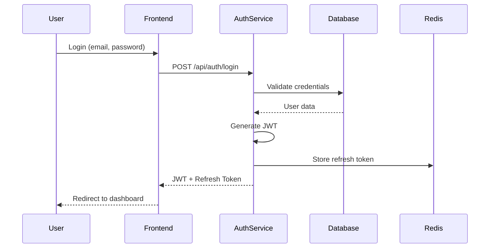
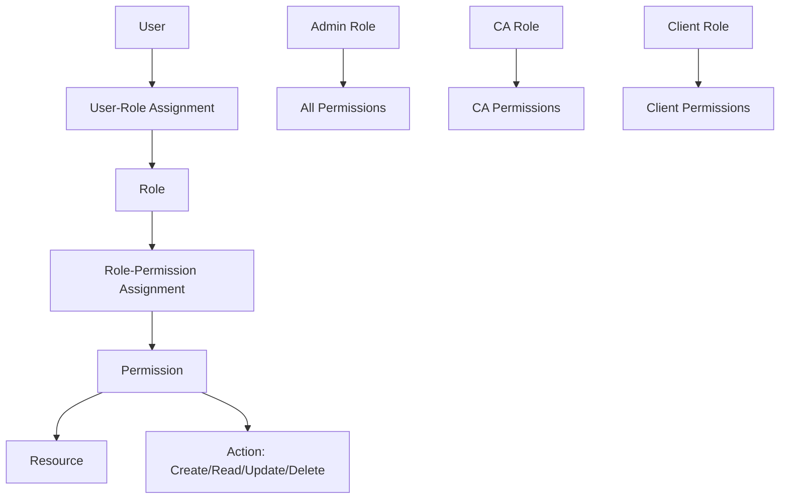
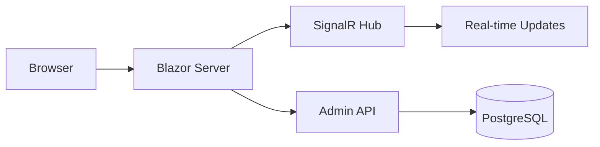
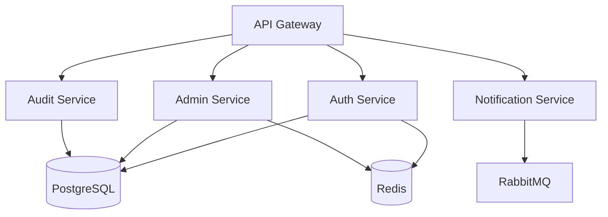

# Tushar - Deliverables

## Document Information

| Property | Value |
|----------|-------|
| Team Member | Tushar |
| Role | .NET Backend Lead |
| Sprint | Week 1-6 (Feb 15 - Mar 28, 2026) |
| Status | In Progress |

## Code Modules

### 1. Authentication Service

**Status**: 📋 Planned
**Priority**: P0
**Deadline**: Week 2

**Deliverables:**
- [ ] ASP.NET Core Identity setup
- [ ] JWT token generation service
- [ ] Token validation middleware
- [ ] Refresh token mechanism
- [ ] Password hashing and validation
- [ ] OAuth2/OIDC integration (Google, Microsoft)

**Files:**
```
KiroTax-AI/backend/microservices/auth/
├── Controllers/
│   └── AuthController.cs
├── Services/
│   ├── AuthService.cs
│   ├── TokenService.cs
│   └── PasswordService.cs
├── Models/
│   ├── LoginRequest.cs
│   ├── RegisterRequest.cs
│   └── TokenResponse.cs
├── Middleware/
│   └── JwtMiddleware.cs
└── Program.cs
```

**API Endpoints:**
```csharp
POST   /api/auth/register
POST   /api/auth/login
POST   /api/auth/refresh-token
POST   /api/auth/logout
POST   /api/auth/forgot-password
POST   /api/auth/reset-password
```

**Tests:**
- [ ] Unit tests for AuthService (>90% coverage)
- [ ] Integration tests for auth endpoints
- [ ] Security tests for token validation
- [ ] Load tests for concurrent logins

### 2. RBAC System

**Status**: 🔄 In Progress
**Priority**: P0
**Deadline**: Week 3

**Deliverables:**
- [ ] Role management service
- [ ] Permission management service
- [ ] User-role assignment
- [ ] Role-permission assignment
- [ ] Authorization middleware
- [ ] Policy-based authorization

**Files:**
```
KiroTax-AI/backend/microservices/auth/
├── Controllers/
│   ├── RoleController.cs
│   └── PermissionController.cs
├── Services/
│   ├── RoleService.cs
│   └── PermissionService.cs
├── Models/
│   ├── Role.cs
│   ├── Permission.cs
│   ├── UserRole.cs
│   └── RolePermission.cs
├── Authorization/
│   ├── PermissionRequirement.cs
│   └── PermissionHandler.cs
└── Policies/
    └── AuthorizationPolicies.cs
```

**Database Schema:**
```sql
CREATE TABLE Roles (
    Id INT PRIMARY KEY,
    Name VARCHAR(50) NOT NULL,
    Description VARCHAR(255),
    CreatedAt TIMESTAMP
);

CREATE TABLE Permissions (
    Id INT PRIMARY KEY,
    Name VARCHAR(50) NOT NULL,
    Resource VARCHAR(50) NOT NULL,
    Action VARCHAR(20) NOT NULL,
    CreatedAt TIMESTAMP
);

CREATE TABLE UserRoles (
    UserId INT,
    RoleId INT,
    AssignedAt TIMESTAMP,
    PRIMARY KEY (UserId, RoleId)
);

CREATE TABLE RolePermissions (
    RoleId INT,
    PermissionId INT,
    GrantedAt TIMESTAMP,
    PRIMARY KEY (RoleId, PermissionId)
);
```

**Tests:**
- [ ] Unit tests for role/permission services
- [ ] Integration tests for authorization
- [ ] Security tests for permission bypass attempts

### 3. Admin Dashboard Service

**Status**: ✅ Complete
**Priority**: P0
**Deadline**: Week 1

**Deliverables:**
- [x] Blazor Server application
- [x] User management UI
- [x] Bill monitoring UI
- [x] Template approval UI
- [x] Activity log viewer
- [x] System settings UI
- [x] Real-time updates (SignalR)

**Files:**
```
KiroTax-AI/backend/microservices/admin/
├── Components/
│   ├── Pages/
│   │   ├── Home.razor
│   │   ├── Users.razor
│   │   ├── Bills.razor
│   │   ├── Templates.razor
│   │   ├── Activity.razor
│   │   └── Settings.razor
│   └── Layout/
│       └── NavMenu.razor
├── Data/
│   ├── Models.cs
│   └── AppDbContext.cs
├── wwwroot/
│   └── css/
│       └── admin.css
└── Program.cs
```

**Admin API Endpoints:**
```csharp
GET    /api/admin/users
POST   /api/admin/users
PUT    /api/admin/users/{id}
DELETE /api/admin/users/{id}
GET    /api/admin/bills
GET    /api/admin/templates
PUT    /api/admin/templates/{id}/approve
GET    /api/admin/activity
GET    /api/admin/settings
PUT    /api/admin/settings
GET    /api/admin/stats
```

**Tests:**
- [x] Unit tests for admin services
- [x] UI tests for Blazor components
- [ ] Integration tests for admin APIs

### 4. Audit Service

**Status**: 📋 Planned
**Priority**: P1
**Deadline**: Week 4

**Deliverables:**
- [ ] Audit logging service
- [ ] Change tracking service
- [ ] Compliance audit trail
- [ ] Data retention management
- [ ] Audit report generation

**Files:**
```
KiroTax-AI/backend/microservices/audit/
├── Controllers/
│   └── AuditController.cs
├── Services/
│   ├── AuditService.cs
│   └── RetentionService.cs
├── Models/
│   ├── AuditLog.cs
│   └── ChangeLog.cs
├── BackgroundServices/
│   └── RetentionWorker.cs
└── Program.cs
```

**Audit Events:**
- User authentication events
- Data modification events
- Permission changes
- System configuration changes
- API access logs

**Tests:**
- [ ] Unit tests for audit service
- [ ] Integration tests for audit logging
- [ ] Compliance tests for retention policy

### 5. Notification Service

**Status**: 📋 Planned
**Priority**: P2
**Deadline**: Week 5

**Deliverables:**
- [ ] Email notification service
- [ ] SMS notification service
- [ ] In-app notification service
- [ ] Webhook service
- [ ] Notification templates
- [ ] Notification queue (RabbitMQ)

**Files:**
```
KiroTax-AI/backend/microservices/notifications/
├── Controllers/
│   └── NotificationController.cs
├── Services/
│   ├── EmailService.cs
│   ├── SmsService.cs
│   ├── InAppService.cs
│   └── WebhookService.cs
├── Models/
│   ├── Notification.cs
│   └── NotificationTemplate.cs
├── Queue/
│   └── NotificationQueue.cs
└── Program.cs
```

**Integrations:**
- SendGrid (Email)
- Twilio (SMS)
- SignalR (Real-time)
- RabbitMQ (Message Queue)

**Tests:**
- [ ] Unit tests for notification services
- [ ] Integration tests for email/SMS
- [ ] Load tests for queue processing

## Diagrams

### 1. Authentication Flow Diagram

**Status**: 📋 Planned
**Deadline**: Week 2

**Deliverable:**


### 2. RBAC Architecture Diagram

**Status**: 📋 Planned
**Deadline**: Week 3

**Deliverable:**


### 3. Admin Dashboard Architecture

**Status**: ✅ Complete
**Deadline**: Week 1

**Deliverable:**


### 4. Microservices Architecture

**Status**: 📋 Planned
**Deadline**: Week 6

**Deliverable:**


## Tests

### 1. Unit Tests

**Status**: 🔄 In Progress
**Coverage Target**: >90%
**Deadline**: Ongoing

**Test Suites:**
- [ ] AuthService tests (20 tests)
- [ ] TokenService tests (15 tests)
- [ ] RoleService tests (18 tests)
- [ ] PermissionService tests (16 tests)
- [ ] AuditService tests (12 tests)
- [ ] NotificationService tests (14 tests)

**Test Framework:**
- xUnit
- Moq (mocking)
- FluentAssertions

**Example Test:**
```csharp
[Fact]
public async Task Login_ValidCredentials_ReturnsToken()
{
    // Arrange
    var authService = new AuthService(_mockUserRepository.Object, _mockTokenService.Object);
    var request = new LoginRequest { Email = "test@example.com", Password = "password123" };
    
    // Act
    var result = await authService.LoginAsync(request);
    
    // Assert
    result.Should().NotBeNull();
    result.AccessToken.Should().NotBeNullOrEmpty();
    result.RefreshToken.Should().NotBeNullOrEmpty();
}
```

### 2. Integration Tests

**Status**: 📋 Planned
**Coverage Target**: All API endpoints
**Deadline**: Week 4

**Test Scenarios:**
- [ ] Auth API integration tests (10 scenarios)
- [ ] Admin API integration tests (15 scenarios)
- [ ] RBAC integration tests (12 scenarios)
- [ ] Database integration tests (8 scenarios)

**Test Framework:**
- xUnit
- WebApplicationFactory
- Testcontainers (for PostgreSQL)

### 3. Security Tests

**Status**: 📋 Planned
**Coverage Target**: All auth flows
**Deadline**: Week 5

**Test Scenarios:**
- [ ] JWT token validation
- [ ] Token expiry handling
- [ ] Refresh token rotation
- [ ] Permission bypass attempts
- [ ] SQL injection prevention
- [ ] XSS attack prevention

### 4. Performance Tests

**Status**: 📋 Planned
**Coverage Target**: All critical APIs
**Deadline**: Week 6

**Test Scenarios:**
- [ ] Concurrent login load test (1000 users)
- [ ] Token validation performance
- [ ] Permission check performance
- [ ] Admin API response time

**Tools:**
- k6 (load testing)
- BenchmarkDotNet (micro-benchmarks)

## Deployment Configs

### 1. Docker Configuration

**Status**: 📋 Planned
**Deadline**: Week 3

**Deliverables:**
- [ ] Dockerfile for Auth service
- [ ] Dockerfile for Admin service
- [ ] Dockerfile for Audit service
- [ ] Dockerfile for Notification service
- [ ] Docker Compose for local development

**Example Dockerfile:**
```dockerfile
FROM mcr.microsoft.com/dotnet/sdk:9.0 AS build
WORKDIR /src
COPY ["auth.csproj", "./"]
RUN dotnet restore
COPY . .
RUN dotnet build -c Release -o /app/build
RUN dotnet publish -c Release -o /app/publish

FROM mcr.microsoft.com/dotnet/aspnet:9.0
WORKDIR /app
COPY --from=build /app/publish .
EXPOSE 5001
ENTRYPOINT ["dotnet", "auth.dll"]
```

### 2. Kubernetes Configuration

**Status**: 📋 Planned
**Deadline**: Week 4

**Deliverables:**
- [ ] Deployment manifests for all services
- [ ] Service manifests
- [ ] ConfigMap for configuration
- [ ] Secret for sensitive data
- [ ] Ingress configuration
- [ ] HPA (Horizontal Pod Autoscaler)

**Example Deployment:**
```yaml
apiVersion: apps/v1
kind: Deployment
metadata:
  name: auth-service
  namespace: kirotax
spec:
  replicas: 3
  selector:
    matchLabels:
      app: auth-service
  template:
    metadata:
      labels:
        app: auth-service
    spec:
      containers:
      - name: auth
        image: kirotax/auth-service:latest
        ports:
        - containerPort: 5001
        env:
        - name: ConnectionStrings__DefaultConnection
          valueFrom:
            secretKeyRef:
              name: db-secrets
              key: connection-string
        resources:
          requests:
            memory: "256Mi"
            cpu: "250m"
          limits:
            memory: "512Mi"
            cpu: "500m"
```

### 3. CI/CD Pipeline

**Status**: 📋 Planned
**Deadline**: Week 5

**Deliverables:**
- [ ] GitHub Actions workflow for .NET services
- [ ] Build and test stages
- [ ] Docker image build and push
- [ ] Kubernetes deployment
- [ ] Smoke tests
- [ ] Rollback mechanism

**Example Workflow:**
```yaml
name: Deploy .NET Services

on:
  push:
    branches: [develop, main]

jobs:
  test:
    runs-on: ubuntu-latest
    steps:
      - uses: actions/checkout@v3
      - name: Setup .NET
        uses: actions/setup-dotnet@v3
        with:
          dotnet-version: '9.0.x'
      - name: Restore dependencies
        run: dotnet restore
      - name: Build
        run: dotnet build --no-restore
      - name: Test
        run: dotnet test --no-build --verbosity normal

  deploy:
    needs: test
    runs-on: ubuntu-latest
    steps:
      - name: Build Docker image
        run: docker build -t kirotax/auth-service:${{ github.sha }} .
      - name: Push to registry
        run: docker push kirotax/auth-service:${{ github.sha }}
      - name: Deploy to Kubernetes
        run: kubectl set image deployment/auth-service auth=kirotax/auth-service:${{ github.sha }}
```

### 4. Monitoring Configuration

**Status**: 📋 Planned
**Deadline**: Week 6

**Deliverables:**
- [ ] Prometheus metrics endpoints
- [ ] Grafana dashboards
- [ ] AlertManager rules
- [ ] Health check endpoints
- [ ] Logging configuration

**Metrics to Expose:**
- Request rate
- Error rate
- Response time (p50, p95, p99)
- Active connections
- Database query time
- Cache hit rate

## Documentation

### 1. API Documentation

**Status**: 🔄 In Progress
**Deadline**: Ongoing

**Deliverables:**
- [ ] Swagger/OpenAPI specification
- [ ] API usage examples
- [ ] Authentication guide
- [ ] Error code reference
- [ ] Rate limiting documentation

### 2. Deployment Documentation

**Status**: 📋 Planned
**Deadline**: Week 5

**Deliverables:**
- [ ] Deployment guide
- [ ] Configuration guide
- [ ] Troubleshooting guide
- [ ] Rollback procedures
- [ ] Disaster recovery plan

### 3. Security Documentation

**Status**: 📋 Planned
**Deadline**: Week 4

**Deliverables:**
- [ ] Security architecture
- [ ] Authentication flow
- [ ] Authorization model
- [ ] Data encryption
- [ ] Compliance requirements

## Milestones

| Milestone | Deadline | Status | Deliverables |
|-----------|----------|--------|--------------|
| Admin Dashboard Complete | Week 1 | ✅ Complete | Admin UI, APIs |
| Authentication Service | Week 2 | 📋 Planned | Auth APIs, JWT |
| RBAC System | Week 3 | 🔄 In Progress | Roles, Permissions |
| Audit Service | Week 4 | 📋 Planned | Audit logging |
| Notification Service | Week 5 | 📋 Planned | Email, SMS, In-app |
| Production Ready | Week 6 | 📋 Planned | All services deployed |

## Dependencies

| Dependency | Provider | Status | Blocker For |
|------------|----------|--------|-------------|
| PostgreSQL Schema | Harit | ✅ Complete | All services |
| Redis Setup | Shivansh | 📋 Planned | Auth service |
| RabbitMQ Setup | Shivansh | 📋 Planned | Notification service |
| Frontend Auth Integration | Shivansh | 📋 Planned | Auth service |
| API Gateway | Shivansh | 📋 Planned | All services |

## Risks and Mitigation

| Risk | Impact | Probability | Mitigation |
|------|--------|-------------|------------|
| JWT security vulnerability | High | Low | Regular security audits, use industry standards |
| Database performance | Medium | Medium | Optimize queries, add indexes, use caching |
| Service downtime | High | Low | Implement health checks, auto-scaling, monitoring |
| Integration delays | Medium | Medium | Clear API contracts, early integration testing |

---

## Document Revision History

| Version | Date | Author | Changes |
|---------|------|--------|---------|
| 1.0.0 | 2026-02-15 | Tushar | Initial deliverables document |

## Approval

| Role | Name | Signature | Date |
|------|------|-----------|------|
| Team Member | Tushar | _________ | ______ |
| Technical Lead | _________ | _________ | ______ |
