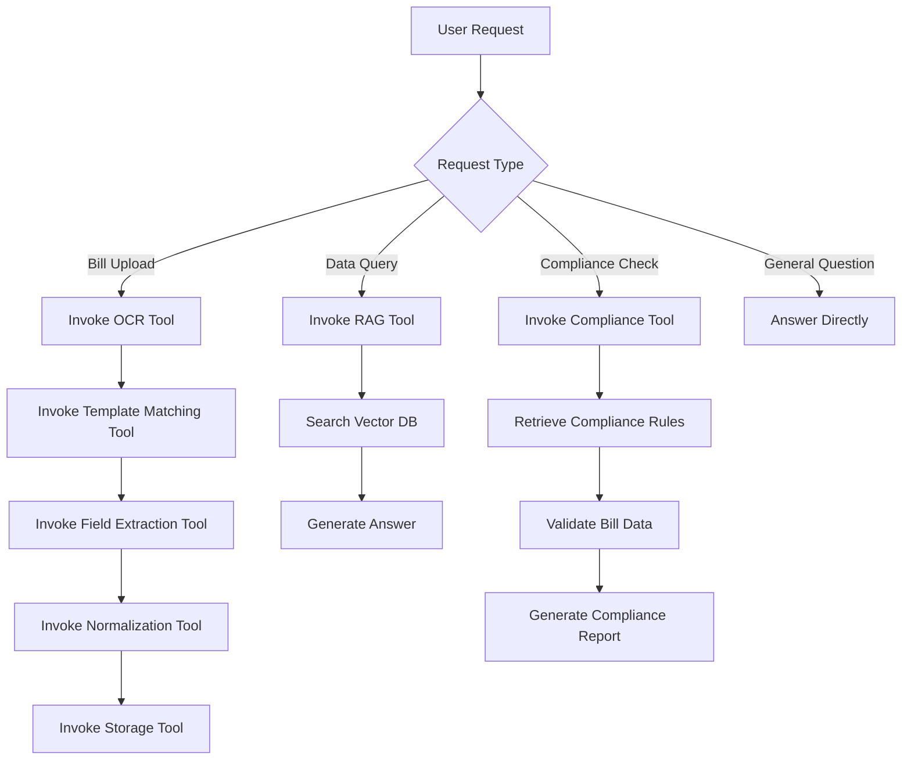

# KiroTax AI - Agent Specification

## Document Information

| Property | Value |
|----------|-------|
| Version | 1.0.0 |
| Last Updated | February 15, 2026 |
| Status | Production |
| Owner | AI/ML Team |
| Reviewers | Harit, Tushar |

## Table of Contents

1. [Agent Overview](#agent-overview)
2. [Agent Goals](#agent-goals)
3. [Tool Invocation Rules](#tool-invocation-rules)
4. [RAG Usage Rules](#rag-usage-rules)
5. [Refusal Conditions](#refusal-conditions)
6. [Safety Policy](#safety-policy)
7. [Logging Requirements](#logging-requirements)
8. [Deterministic Execution Policy](#deterministic-execution-policy)

## 1. Agent Overview

### 1.1 Purpose

The KiroTax AI Agent is an intelligent assistant designed to automate bill processing, compliance validation, and provide conversational interfaces for tax-related queries. The agent leverages Google Gemini AI for natural language understanding and generation.

### 1.2 Agent Capabilities

- **Bill Data Extraction**: Extract structured data from unstructured bill images/PDFs
- **Compliance Validation**: Validate bills against GST and tax regulations
- **Natural Language Queries**: Answer questions about bills, compliance, and tax rules
- **Anomaly Detection**: Identify suspicious patterns in bill data
- **Smart Categorization**: Automatically categorize bills by type and purpose

### 1.3 Agent Limitations

- Cannot process bills without OCR text
- Cannot validate compliance without relevant rules in knowledge base
- Cannot make financial decisions or provide legal advice
- Cannot access external systems without explicit tool invocation
- Cannot store or remember conversation history beyond current session

## 2. Agent Goals

### 2.1 Primary Goals

1. **Accuracy**: Extract bill data with >95% accuracy
2. **Compliance**: Validate 100% of bills against applicable regulations
3. **Speed**: Process bills in <5 seconds end-to-end
4. **Reliability**: Maintain 99.9% uptime and availability
5. **Security**: Protect sensitive financial data at all times

### 2.2 Success Metrics

| Metric | Target | Measurement Method |
|--------|--------|-------------------|
| Field Extraction Accuracy | >95% | Manual validation sample |
| Compliance Detection Rate | >98% | Audit review |
| False Positive Rate | <2% | User feedback |
| Processing Time | <5s | System metrics |
| User Satisfaction | >4.5/5 | User surveys |

### 2.3 Failure Modes

**Graceful Degradation:**
- If Gemini AI unavailable: Fall back to rule-based extraction
- If Vector DB unavailable: Skip compliance validation, flag for manual review
- If OCR fails: Request manual data entry
- If template not found: Use generic template with manual verification

## 3. Tool Invocation Rules

### 3.1 Tool Selection Criteria

The agent MUST follow this decision tree for tool selection:



### 3.2 Tool Invocation Sequence

**Bill Processing Sequence:**
```
1. ocr_extract_text(image_url)
2. detect_layout(ocr_text)
3. match_template(ocr_text, layout_type)
4. extract_fields(ocr_text, template)
5. normalize_data(extracted_fields)
6. validate_compliance(normalized_data)
7. store_bill(validated_data)
```

**Query Processing Sequence:**
```
1. classify_query(user_question)
2. retrieve_context(query_embedding)
3. generate_answer(context, question)
4. validate_answer(answer, sources)
```

### 3.3 Tool Invocation Constraints

**MUST Rules:**
- MUST validate input parameters before tool invocation
- MUST handle tool errors gracefully
- MUST log all tool invocations
- MUST respect tool timeout limits
- MUST retry failed tools up to 3 times with exponential backoff

**MUST NOT Rules:**
- MUST NOT invoke tools in parallel without explicit permission
- MUST NOT invoke tools with PII data in logs
- MUST NOT bypass tool validation
- MUST NOT cache tool results beyond session
- MUST NOT invoke deprecated tools

### 3.4 Tool Timeout Policy

| Tool | Timeout | Retry Policy |
|------|---------|--------------|
| OCR Extraction | 30s | 3 retries, 2s backoff |
| Template Matching | 5s | 2 retries, 1s backoff |
| Field Extraction | 10s | 3 retries, 2s backoff |
| Compliance Validation | 15s | 2 retries, 3s backoff |
| Vector Search | 5s | 3 retries, 1s backoff |
| Gemini AI Call | 20s | 2 retries, 5s backoff |

### 3.5 Tool Error Handling

**Error Response Format:**
```json
{
  "success": false,
  "error": {
    "code": "TOOL_TIMEOUT",
    "message": "OCR extraction timed out after 30 seconds",
    "tool": "ocr_extract_text",
    "retry_count": 3,
    "timestamp": "2026-02-15T10:30:00Z"
  },
  "fallback_action": "request_manual_entry"
}
```

**Error Handling Strategy:**
1. Log error with full context
2. Attempt retry if applicable
3. Fall back to alternative method
4. Notify user of degraded functionality
5. Escalate to human if critical

## 4. RAG Usage Rules

### 4.1 RAG Architecture

```mermaid
flowchart LR
    Query[User Query] --> Embed[Generate Embedding]
    Embed --> Search[Vector Search]
    Search --> Retrieve[Retrieve Top-K Documents]
    Retrieve --> Rerank[Rerank by Relevance]
    Rerank --> Context[Build Context]
    Context --> Generate[Generate Answer]
    Generate --> Validate[Validate Answer]
    Validate --> Response[Return Response]
```



### 4.2 Knowledge Base Structure

**Document Types:**
1. **Compliance Rules**: GST regulations, tax laws, industry standards
2. **Bill Templates**: Template definitions and field mappings
3. **Historical Data**: Previously processed bills for pattern matching
4. **FAQ**: Common questions and answers

**Embedding Strategy:**
- Model: Google Generative AI Embeddings (text-embedding-004)
- Dimension: 768
- Chunking: 512 tokens with 50 token overlap
- Metadata: document_type, source, date, version

### 4.3 Retrieval Rules

**MUST Rules:**
- MUST retrieve at least 5 documents for context
- MUST filter by document type when applicable
- MUST rerank results by relevance score
- MUST include source citations in response
- MUST validate retrieved documents are current (not deprecated)

**Retrieval Parameters:**
```python
{
  "top_k": 10,
  "min_relevance_score": 0.7,
  "max_context_length": 4000,
  "include_metadata": True,
  "filter": {
    "document_type": "compliance_rule",
    "status": "active"
  }
}
```

### 4.4 Context Building

**Context Template:**
```
Based on the following compliance rules:

[Rule 1]: {rule_text}
Source: {source}
Effective Date: {date}

[Rule 2]: {rule_text}
Source: {source}
Effective Date: {date}

...

Question: {user_question}

Provide a detailed answer with citations.
```

**Context Limits:**
- Maximum context length: 4000 tokens
- Maximum number of documents: 10
- Minimum relevance score: 0.7
- Maximum age of documents: 2 years (unless explicitly requested)

### 4.5 Answer Generation Rules

**MUST Rules:**
- MUST cite sources for all factual claims
- MUST indicate confidence level
- MUST flag outdated information
- MUST provide alternative interpretations if ambiguous
- MUST refuse to answer if insufficient context

**Answer Format:**
```
Answer: {generated_answer}

Confidence: {high|medium|low}

Sources:
1. {source_1} (Relevance: {score})
2. {source_2} (Relevance: {score})

Last Updated: {date}
```

### 4.6 RAG Quality Metrics

| Metric | Target | Measurement |
|--------|--------|-------------|
| Retrieval Precision | >90% | Manual evaluation |
| Answer Accuracy | >95% | Expert review |
| Citation Accuracy | 100% | Automated validation |
| Response Time | <2s | System metrics |

## 5. Refusal Conditions

### 5.1 Mandatory Refusal Scenarios

The agent MUST refuse to process requests in the following scenarios:

**1. Insufficient Data:**
```
Condition: OCR text quality < 70%
Response: "The bill image quality is too low for accurate processing. Please upload a clearer image."
Action: Request re-upload
```

**2. Unsupported Bill Type:**
```
Condition: No matching template found AND confidence < 50%
Response: "This bill format is not currently supported. Please contact support to add this template."
Action: Flag for manual review
```

**3. Compliance Rule Not Found:**
```
Condition: No relevant compliance rules in knowledge base
Response: "I cannot validate compliance for this bill type as the relevant regulations are not in my knowledge base."
Action: Flag for expert review
```

**4. Ambiguous Query:**
```
Condition: Multiple interpretations with similar confidence
Response: "Your question is ambiguous. Did you mean: [Option 1] or [Option 2]?"
Action: Request clarification
```

**5. Out of Scope:**
```
Condition: Request for legal advice, financial decisions, or personal opinions
Response: "I cannot provide legal or financial advice. Please consult a qualified professional."
Action: Log and refuse
```

**6. Data Privacy Violation:**
```
Condition: Request to access data without proper authorization
Response: "You do not have permission to access this data."
Action: Log security event and refuse
```

### 5.2 Refusal Response Format

```json
{
  "success": false,
  "refusal": {
    "reason": "insufficient_data",
    "message": "The bill image quality is too low for accurate processing.",
    "suggested_action": "upload_clearer_image",
    "help_url": "https://help.kirotax.ai/bill-upload-guidelines"
  }
}
```

### 5.3 Escalation Rules

**Automatic Escalation:**
- 3+ consecutive refusals for same user → Escalate to support
- Compliance validation failure → Escalate to CA
- Security policy violation → Escalate to security team
- System error → Escalate to engineering

## 6. Safety Policy

### 6.1 Data Protection

**PII Handling:**
- MUST NOT log PII data (names, addresses, phone numbers, email)
- MUST mask sensitive fields in logs (last 4 digits only)
- MUST encrypt PII data at rest and in transit
- MUST comply with GDPR and data protection regulations

**Data Retention:**
- Bill data: 7 years (compliance requirement)
- Conversation logs: 90 days
- Error logs: 30 days
- Audit logs: 7 years

### 6.2 Content Safety

**Prohibited Content:**
- Hate speech or discriminatory content
- Violent or graphic content
- Illegal activities or fraud
- Misinformation or false claims
- Spam or malicious content

**Content Filtering:**
- Pre-processing: Filter input for prohibited content
- Post-processing: Validate generated responses
- Monitoring: Continuous content safety monitoring
- Reporting: Flag violations for review

### 6.3 Bias Mitigation

**Fairness Principles:**
- Equal treatment regardless of user demographics
- No discrimination based on bill amount or type
- Consistent compliance validation across all users
- Transparent decision-making process

**Bias Testing:**
- Regular audits for demographic bias
- A/B testing for fairness
- User feedback analysis
- Third-party bias assessment

### 6.4 Security Controls

**Access Control:**
- Role-based access to agent features
- API key authentication for tool invocation
- Rate limiting to prevent abuse
- IP whitelisting for admin functions

**Threat Protection:**
- Input validation and sanitization
- SQL injection prevention
- XSS attack prevention
- CSRF token validation
- DDoS protection

## 7. Logging Requirements

### 7.1 Log Levels

| Level | Usage | Retention |
|-------|-------|-----------|
| ERROR | System errors, exceptions | 30 days |
| WARN | Potential issues, degraded performance | 30 days |
| INFO | Important business events | 90 days |
| DEBUG | Detailed diagnostic information | 7 days |

### 7.2 Required Log Fields

**All Logs MUST Include:**
```json
{
  "timestamp": "2026-02-15T10:30:00Z",
  "level": "INFO",
  "service": "agent",
  "trace_id": "abc123",
  "user_id": "user_456",
  "session_id": "session_789",
  "message": "Bill processed successfully",
  "metadata": {}
}
```

### 7.3 Event Logging

**Agent Events to Log:**
- Agent invocation (start/end)
- Tool invocation (start/end/error)
- RAG retrieval (query/results)
- Answer generation (prompt/response)
- Refusal events
- Error events
- Performance metrics

**Example Log Entry:**
```json
{
  "timestamp": "2026-02-15T10:30:00Z",
  "level": "INFO",
  "service": "agent",
  "event": "bill_processed",
  "trace_id": "abc123",
  "user_id": "user_456",
  "bill_id": "bill_789",
  "processing_time_ms": 4250,
  "tools_invoked": ["ocr_extract", "template_match", "field_extract"],
  "accuracy_score": 0.96,
  "compliance_status": "pass"
}
```

### 7.4 Audit Logging

**Audit Events:**
- User authentication
- Data access
- Configuration changes
- Permission changes
- Compliance violations
- Security events

**Audit Log Format:**
```json
{
  "timestamp": "2026-02-15T10:30:00Z",
  "event_type": "data_access",
  "user_id": "user_456",
  "resource": "bill_789",
  "action": "read",
  "ip_address": "192.168.1.100",
  "user_agent": "Mozilla/5.0...",
  "result": "success"
}
```

## 8. Deterministic Execution Policy

### 8.1 Determinism Requirements

**Deterministic Operations:**
- Template matching (same input → same template)
- Field extraction (same template → same fields)
- Data normalization (same data → same format)
- Compliance validation (same rules → same result)

**Non-Deterministic Operations:**
- Gemini AI responses (may vary slightly)
- Vector search results (may vary with index updates)
- Anomaly detection (threshold-based)

### 8.2 Reproducibility

**Requirements:**
- All tool invocations MUST be reproducible with same inputs
- All decisions MUST be explainable
- All results MUST be auditable
- All errors MUST be traceable

**Reproducibility Checklist:**
- [ ] Input parameters logged
- [ ] Tool versions logged
- [ ] Model versions logged
- [ ] Random seeds fixed (where applicable)
- [ ] Timestamps recorded
- [ ] Results stored

### 8.3 Version Control

**Versioning Strategy:**
- Agent version: Semantic versioning (1.0.0)
- Tool version: Semantic versioning (1.0.0)
- Model version: Provider versioning (gemini-1.5-pro)
- Knowledge base version: Date-based (2026-02-15)

**Version Compatibility:**
- Backward compatibility for 2 major versions
- Deprecation notice 90 days before removal
- Migration guide for breaking changes

### 8.4 Testing Requirements

**Test Coverage:**
- Unit tests: >90% coverage
- Integration tests: All tool combinations
- End-to-end tests: All user workflows
- Performance tests: Load and stress testing
- Security tests: Penetration testing

**Test Scenarios:**
```
1. Happy path: Standard bill processing
2. Error path: OCR failure, template not found
3. Edge cases: Unusual bill formats, missing fields
4. Performance: High load, concurrent requests
5. Security: Unauthorized access, injection attacks
```

---

## Document Revision History

| Version | Date | Author | Changes |
|---------|------|--------|---------|
| 1.0.0 | 2026-02-15 | AI/ML Team | Initial production release |

## Approval

| Role | Name | Signature | Date |
|------|------|-----------|------|
| AI/ML Lead | Harit | _________ | ______ |
| Technical Lead | Tushar | _________ | ______ |
| Security Lead | _________ | _________ | ______ |
