# KiroTax AI - System Architecture

## Document Information

| Property | Value |
|----------|-------|
| Version | 1.0.0 |
| Last Updated | February 15, 2026 |
| Status | Production |
| Owner | Architecture Team |
| Reviewers | Tushar, Harit, Shivansh |

## Table of Contents

1. [System Overview](#system-overview)
2. [Logical Architecture](#logical-architecture)
3. [Component Responsibilities](#component-responsibilities)
4. [Data Flow](#data-flow)
5. [Security Model](#security-model)
6. [Network Topology](#network-topology)
7. [Deployment Layers](#deployment-layers)
8. [Observability](#observability)

## 1. System Overview

### 1.1 Purpose

KiroTax AI is an enterprise-grade intelligent bill processing and compliance platform designed for Chartered Accountants (CAs) and their clients. The system automates bill extraction, validation, and compliance checking using AI/ML technologies.

### 1.2 Key Capabilities

- **Automated Bill Processing**: OCR-based text extraction with 98%+ accuracy
- **Template Recognition**: Support for 1000+ bill formats using hierarchical template system
- **AI-Powered Validation**: Google Gemini AI for intelligent field extraction
- **Compliance Engine**: RAG-based compliance validation against GST and tax regulations
- **Role-Based Access**: Multi-tenant architecture with granular permissions
- **Workflow Automation**: Configurable approval workflows for CA firms

### 1.3 System Constraints

- **Performance**: API response time < 200ms (p95)
- **Scalability**: Support 10,000+ concurrent users
- **Availability**: 99.9% uptime SLA
- **Data Retention**: 7 years for compliance
- **Security**: SOC 2 Type II compliant

## 2. Logical Architecture

### 2.1 High-Level Architecture

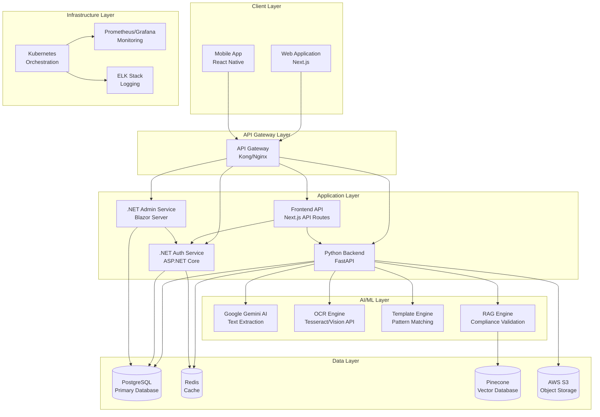

### 2.2 Component Architecture

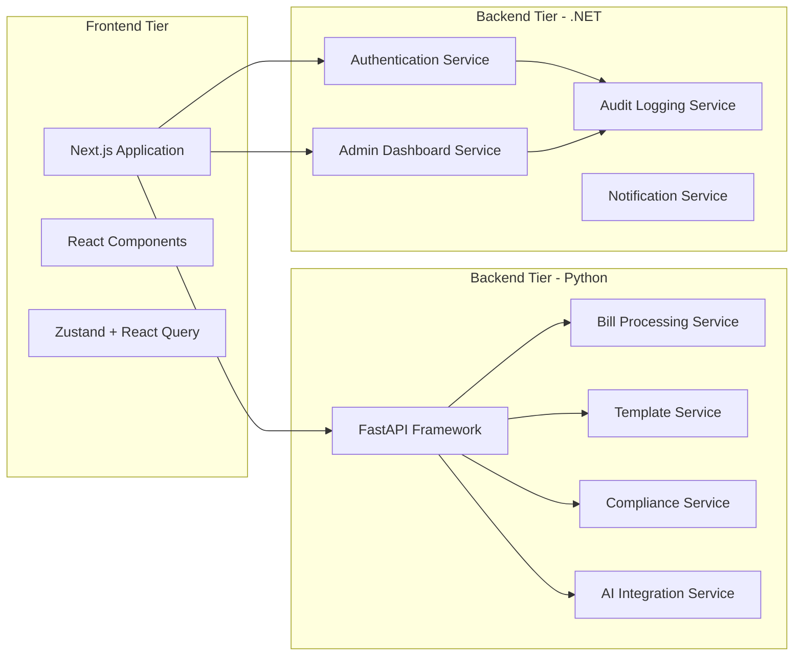

## 3. Component Responsibilities

### 3.1 Frontend Components

#### 3.1.1 Next.js Application (Owner: Shivansh)

**Responsibilities:**
- Server-side rendering and static generation
- API route handlers for BFF pattern
- Authentication state management
- Client-side routing
- SEO optimization

**Technology Stack:**
- Next.js 14 (App Router)
- React 18
- TypeScript
- Tailwind CSS

**Key Modules:**
- `app/(auth)/*` - Authentication pages
- `app/(dashboard)/*` - Client portal
- `app/(ca-portal)/*` - CA dashboard
- `app/api/*` - API routes

#### 3.1.2 UI Component Library (Owner: Bhavya)

**Responsibilities:**
- Reusable component development
- Design system implementation
- Accessibility compliance (WCAG 2.1 AA)
- Component documentation

**Technology Stack:**
- shadcn/ui
- Radix UI primitives
- Framer Motion
- Storybook

**Key Components:**
- Form components (Input, Select, Checkbox, etc.)
- Data display (Table, Card, Badge)
- Feedback (Toast, Dialog, Alert)
- Navigation (Menu, Breadcrumb, Tabs)

### 3.2 Backend Components - Python

#### 3.2.1 Bill Processing Service (Owner: Harit)

**Responsibilities:**
- OCR text extraction
- Layout detection and classification
- Template matching
- Field extraction and normalization
- Quality validation

**Technology Stack:**
- FastAPI
- Tesseract OCR
- Google Vision API
- Pandas
- SQLAlchemy

**API Endpoints:**
```
POST   /api/bills/upload
GET    /api/bills/{id}
GET    /api/bills/
POST   /api/bills/{id}/reprocess
DELETE /api/bills/{id}
```

**Processing Pipeline:**
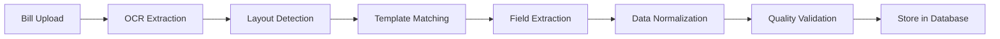

#### 3.2.2 Template Engine (Owner: Harit)

**Responsibilities:**
- Template detection and matching
- Hierarchical template management
- Custom template creation
- Template versioning
- Marketplace integration

**Architecture:**
```
templates/
├── layouts/          # Layout classifiers
├── base/             # Base templates
├── orgs/             # Organization-specific
└── schemas/          # Normalized schemas
```

**Template Hierarchy:**
1. Layout Classification (4 types)
2. Base Template Matching (50+ templates)
3. Organization Override (custom templates)
4. Field Mapping (universal schema)

#### 3.2.3 AI Integration Service (Owner: Harit)

**Responsibilities:**
- Google Gemini AI integration
- Intelligent field extraction
- Anomaly detection
- Natural language query processing
- Fraud detection

**Technology Stack:**
- Google Generative AI SDK
- LangChain
- Prompt engineering
- Response parsing

**Use Cases:**
- Smart field extraction from unstructured text
- Compliance rule interpretation
- Bill categorization
- Conversational queries

#### 3.2.4 RAG Compliance Engine (Owner: Harit)

**Responsibilities:**
- Compliance rule storage and retrieval
- Semantic search over regulations
- Real-time validation
- Audit trail generation

**Technology Stack:**
- Pinecone (Vector Database)
- LangChain
- Google Generative AI Embeddings
- FastAPI

**Architecture:**
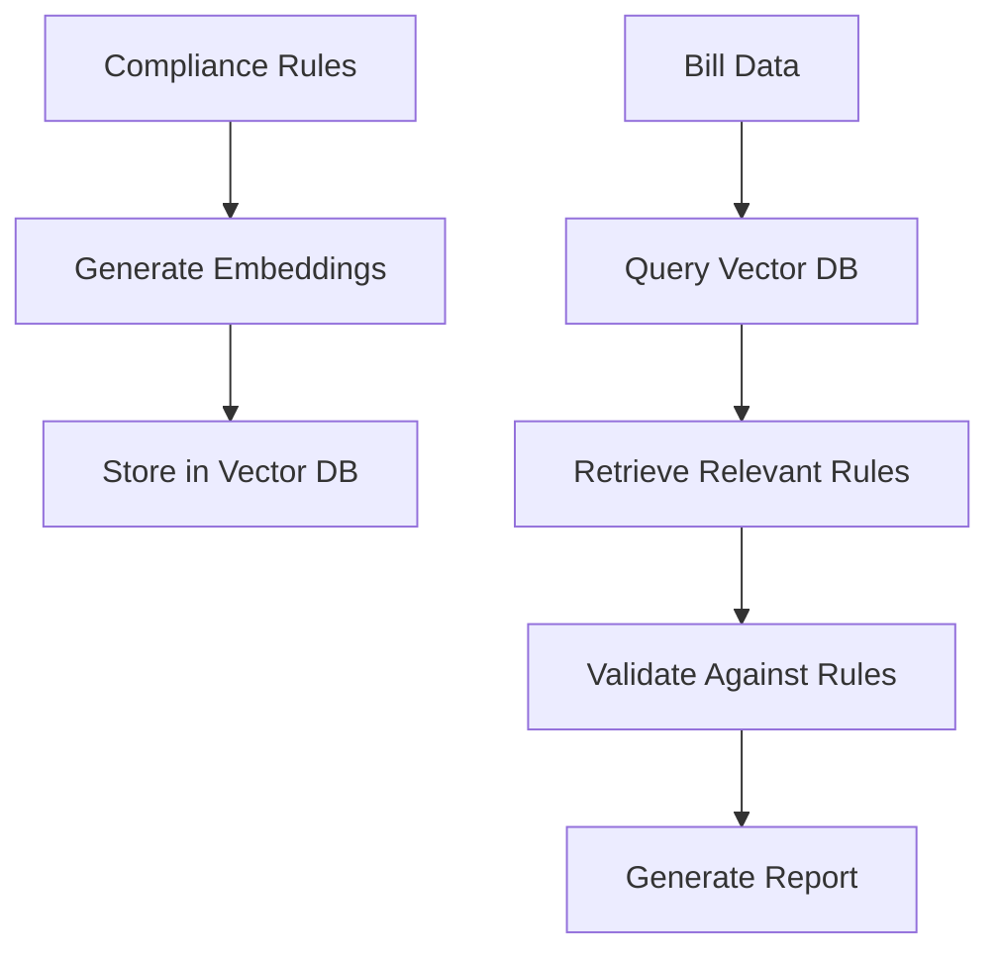

### 3.3 Backend Components - .NET

#### 3.3.1 Authentication Service (Owner: Tushar)

**Responsibilities:**
- User authentication (JWT)
- Role-based authorization
- Permission management
- Token generation and validation
- OAuth2/OIDC integration

**Technology Stack:**
- ASP.NET Core 9
- ASP.NET Core Identity
- JWT Bearer Authentication
- Entity Framework Core

**API Endpoints:**
```
POST   /api/auth/register
POST   /api/auth/login
POST   /api/auth/refresh-token
POST   /api/auth/logout
POST   /api/auth/forgot-password
POST   /api/auth/reset-password
```

**Security Model:**
- JWT tokens with 15-minute expiry
- Refresh tokens with 7-day expiry
- Role-based access control (RBAC)
- Permission-based authorization
- Multi-factor authentication (MFA)

#### 3.3.2 Admin Dashboard Service (Owner: Tushar)

**Responsibilities:**
- User management interface
- Bill processing monitoring
- Template approval workflow
- System configuration
- Activity logging and audit

**Technology Stack:**
- Blazor Server
- SignalR (real-time updates)
- Entity Framework Core
- Bootstrap 5

**Admin API Endpoints:**
```
GET    /api/admin/users
POST   /api/admin/users
PUT    /api/admin/users/{id}
DELETE /api/admin/users/{id}
GET    /api/admin/bills
GET    /api/admin/templates
PUT    /api/admin/templates/{id}/approve
GET    /api/admin/activity
GET    /api/admin/settings
PUT    /api/admin/settings
GET    /api/admin/stats
```

**Dashboard Features:**
- Real-time statistics
- User management (CRUD)
- Bill processing monitoring
- Template approval workflow
- Activity log viewer
- System settings configuration

#### 3.3.3 Audit Service (Owner: Tushar)

**Responsibilities:**
- Activity logging
- Change tracking
- Compliance audit trail
- Data retention management

**Technology Stack:**
- ASP.NET Core
- Entity Framework Core
- PostgreSQL
- Background services

**Audit Events:**
- User authentication events
- Data modification events
- Permission changes
- System configuration changes
- API access logs

#### 3.3.4 Notification Service (Owner: Tushar)

**Responsibilities:**
- Email notifications
- SMS alerts
- In-app notifications
- Webhook triggers
- Notification templates

**Technology Stack:**
- ASP.NET Core
- SendGrid (Email)
- Twilio (SMS)
- SignalR (Real-time)
- RabbitMQ (Message Queue)

## 4. Data Flow

### 4.1 Bill Upload and Processing Flow

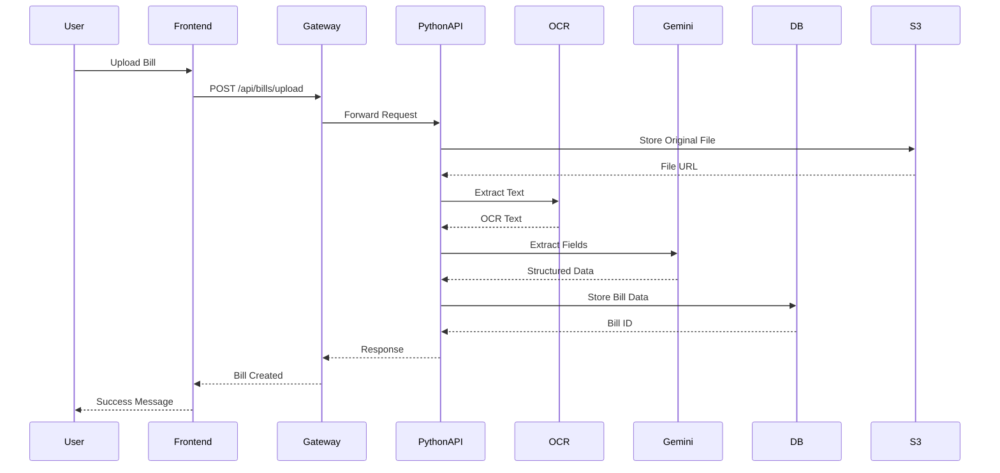

### 4.2 Authentication Flow

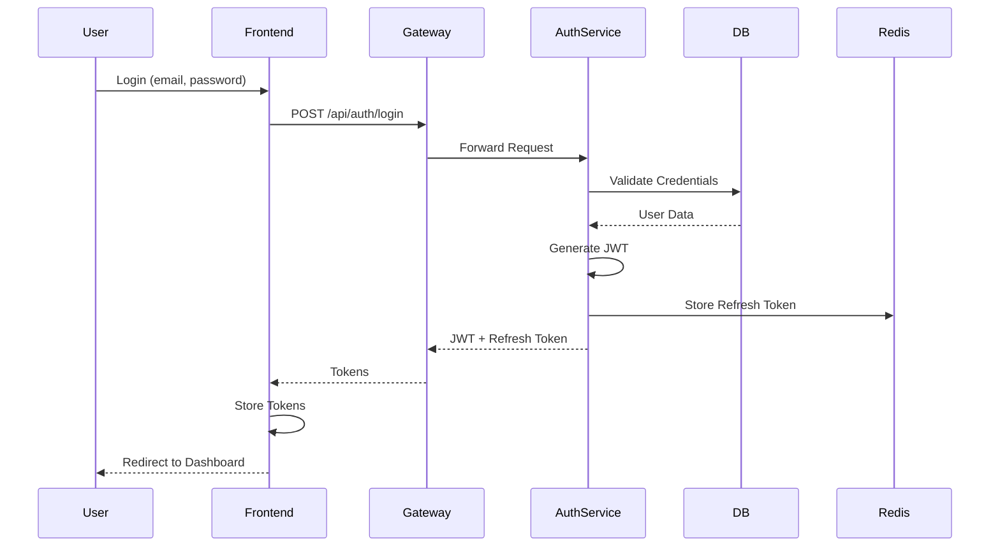

### 4.3 Compliance Validation Flow

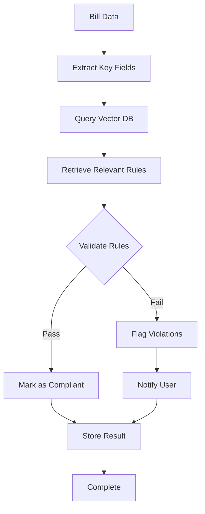

### 4.4 Template Matching Flow

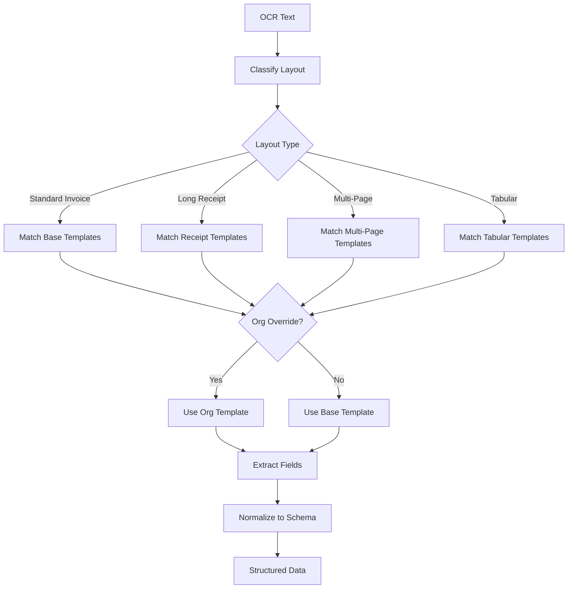

## 5. Security Model

### 5.1 Authentication and Authorization

**Authentication Mechanisms:**
- JWT-based authentication
- OAuth2/OIDC for third-party login
- Multi-factor authentication (MFA)
- Session management with Redis

**Authorization Model:**
- Role-Based Access Control (RBAC)
- Permission-based authorization
- Resource-level permissions
- Hierarchical role inheritance

**Roles:**
```
Admin
├── Full system access
├── User management
├── System configuration
└── Audit log access

CA (Chartered Accountant)
├── Client management
├── Bill processing
├── Workflow management
└── Report generation

Auditor
├── Read-only access
├── Compliance reports
└── Audit trail access

Client
├── Bill upload
├── View own bills
└── Download reports
```

### 5.2 Data Security

**Encryption:**
- Data at rest: AES-256 encryption
- Data in transit: TLS 1.3
- Database encryption: PostgreSQL native encryption
- S3 encryption: Server-side encryption (SSE-S3)

**Data Protection:**
- PII data masking in logs
- Sensitive field encryption
- Secure key management (AWS KMS)
- Regular security audits

### 5.3 Network Security

**Security Layers:**
- Web Application Firewall (WAF)
- DDoS protection (CloudFlare)
- API rate limiting
- IP whitelisting for admin access
- VPC isolation

**Security Groups:**
```
Frontend SG: Allow 443 from Internet
API Gateway SG: Allow 443 from Frontend SG
Backend SG: Allow 8000 from API Gateway SG
Database SG: Allow 5432 from Backend SG
```

### 5.4 Compliance

**Standards:**
- SOC 2 Type II
- GDPR compliance
- ISO 27001
- PCI DSS (for payment data)

**Audit Requirements:**
- All API calls logged
- User activity tracked
- Data access audited
- 7-year retention for compliance

## 6. Network Topology

### 6.1 Network Architecture

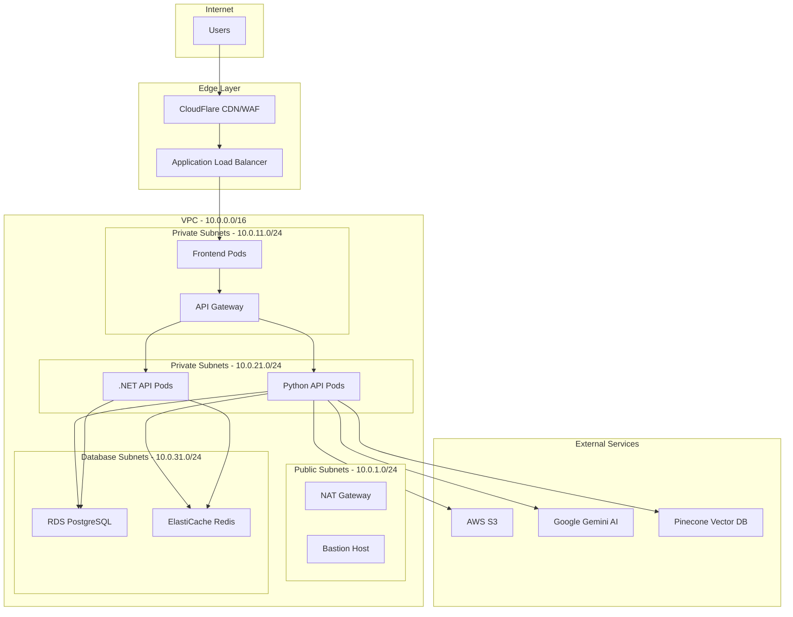

### 6.2 Subnet Design

| Subnet Type | CIDR | Purpose | Internet Access |
|-------------|------|---------|-----------------|
| Public | 10.0.1.0/24 | NAT Gateway, Bastion | Yes |
| Private (App) | 10.0.11.0/24 | Frontend, API Gateway | Via NAT |
| Private (Backend) | 10.0.21.0/24 | Python API, .NET API | Via NAT |
| Database | 10.0.31.0/24 | RDS, ElastiCache | No |

### 6.3 Security Groups

**Frontend Security Group:**
```
Inbound:
- Port 443 from ALB
- Port 3000 from ALB

Outbound:
- Port 8000 to Backend SG
- Port 443 to Internet (for external APIs)
```

**Backend Security Group:**
```
Inbound:
- Port 8000 from Frontend SG
- Port 5001 from Frontend SG

Outbound:
- Port 5432 to Database SG
- Port 6379 to Cache SG
- Port 443 to Internet (for Gemini, Pinecone)
```

**Database Security Group:**
```
Inbound:
- Port 5432 from Backend SG

Outbound:
- None
```

## 7. Deployment Layers

### 7.1 Environment Strategy

| Environment | Purpose | Infrastructure | Deployment |
|-------------|---------|----------------|------------|
| Development | Local development | Docker Compose | Manual |
| Staging | Pre-production testing | Kubernetes (2 nodes) | Auto (develop branch) |
| Production | Live system | Kubernetes (5+ nodes) | Manual (main branch) |

### 7.2 Kubernetes Architecture

```mermaid
graph TB
    subgraph "Kubernetes Cluster"
        subgraph "Ingress"
            Ingress[Nginx Ingress Controller]
        end
        
        subgraph "Frontend Namespace"
            FrontendDeploy[Frontend Deployment<br/>3 replicas]
            FrontendSvc[Frontend Service]
        end
        
        subgraph "Backend Namespace"
            PythonDeploy[Python API Deployment<br/>5 replicas]
            PythonSvc[Python API Service]
            DotNetDeploy[.NET API Deployment<br/>3 replicas]
            DotNetSvc[.NET API Service]
        end
        
        subgraph "Admin Namespace"
            AdminDeploy[Admin Dashboard Deployment<br/>2 replicas]
            AdminSvc[Admin Service]
        end
        
        Ingress --> FrontendSvc
        Ingress --> PythonSvc
        Ingress --> DotNetSvc
        Ingress --> AdminSvc
        
        FrontendSvc --> FrontendDeploy
        PythonSvc --> PythonDeploy
        DotNetSvc --> DotNetDeploy
        AdminSvc --> AdminDeploy
    end
```

### 7.3 Scaling Strategy

**Horizontal Pod Autoscaler (HPA):**
```yaml
Frontend:
  minReplicas: 3
  maxReplicas: 10
  targetCPU: 70%

Python API:
  minReplicas: 5
  maxReplicas: 20
  targetCPU: 70%

.NET API:
  minReplicas: 3
  maxReplicas: 10
  targetCPU: 70%
```

**Database Scaling:**
- Read replicas for read-heavy operations
- Connection pooling (PgBouncer)
- Query optimization and indexing

**Cache Strategy:**
- Redis cluster for high availability
- Cache-aside pattern
- TTL-based expiration

### 7.4 Deployment Process

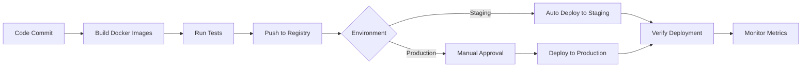

## 8. Observability

### 8.1 Monitoring Stack

**Components:**
- Prometheus: Metrics collection
- Grafana: Visualization
- AlertManager: Alerting
- Jaeger: Distributed tracing

**Key Metrics:**
```
Application Metrics:
- Request rate (requests/second)
- Error rate (errors/second)
- Response time (p50, p95, p99)
- Active users

Business Metrics:
- Bills processed per hour
- Template detection accuracy
- Compliance validation rate
- User registration rate

Infrastructure Metrics:
- CPU utilization
- Memory usage
- Disk I/O
- Network throughput
```

### 8.2 Logging Strategy

**ELK Stack:**
- Elasticsearch: Log storage
- Logstash: Log processing
- Kibana: Log visualization

**Log Levels:**
```
ERROR: System errors, exceptions
WARN: Potential issues, degraded performance
INFO: Important business events
DEBUG: Detailed diagnostic information
```

**Log Format:**
```json
{
  "timestamp": "2026-02-15T10:30:00Z",
  "level": "INFO",
  "service": "python-api",
  "trace_id": "abc123",
  "user_id": "user_456",
  "message": "Bill processed successfully",
  "metadata": {
    "bill_id": "bill_789",
    "processing_time_ms": 1250
  }
}
```

### 8.3 Alerting Rules

**Critical Alerts:**
- API error rate > 5%
- Response time p95 > 1s
- Database connection pool exhausted
- Disk usage > 90%
- Pod crash loop

**Warning Alerts:**
- API error rate > 2%
- Response time p95 > 500ms
- Memory usage > 80%
- CPU usage > 80%

### 8.4 Distributed Tracing

**Trace Flow:**
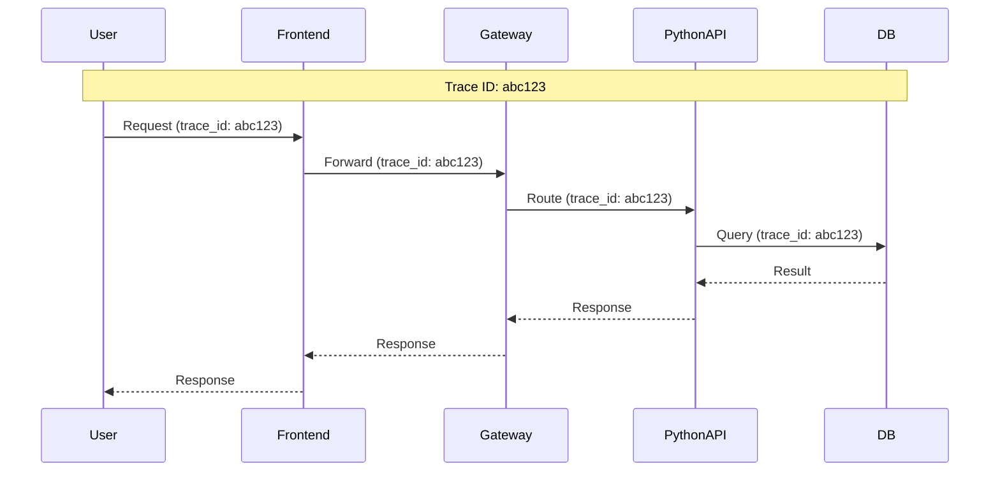

## 9. Disaster Recovery

### 9.1 Backup Strategy

**Database Backups:**
- Automated daily backups
- Point-in-time recovery (PITR)
- 30-day retention
- Cross-region replication

**S3 Backups:**
- Versioning enabled
- Lifecycle policies
- Cross-region replication
- Glacier archival after 90 days

### 9.2 Recovery Procedures

**RTO (Recovery Time Objective):** 4 hours
**RPO (Recovery Point Objective):** 1 hour

**Recovery Steps:**
1. Identify failure scope
2. Activate disaster recovery plan
3. Restore from backups
4. Verify data integrity
5. Resume operations
6. Post-mortem analysis

## 10. Performance Targets

| Metric | Target | Measurement |
|--------|--------|-------------|
| API Response Time (p95) | < 200ms | Prometheus |
| Bill Processing Time | < 5s | Application logs |
| OCR Accuracy | > 98% | Quality metrics |
| Template Detection Accuracy | > 90% | Validation tests |
| System Uptime | 99.9% | Monitoring |
| Database Query Time (p95) | < 50ms | Database metrics |
| Cache Hit Rate | > 80% | Redis metrics |

## 11. Capacity Planning

**Current Capacity:**
- 10,000 concurrent users
- 100,000 bills/day
- 1TB storage

**Growth Projections:**
- Year 1: 50,000 concurrent users
- Year 2: 100,000 concurrent users
- Year 3: 250,000 concurrent users

**Scaling Plan:**
- Horizontal scaling for application tier
- Database sharding for data tier
- CDN for static assets
- Multi-region deployment

---

## Document Revision History

| Version | Date | Author | Changes |
|---------|------|--------|---------|
| 1.0.0 | 2026-02-15 | Architecture Team | Initial production release |

## Approval

| Role | Name | Signature | Date |
|------|------|-----------|------|
| Technical Lead | Tushar | _________ | ______ |
| Backend Lead | Harit | _________ | ______ |
| Frontend Lead | Shivansh | _________ | ______ |
| Product Owner | _________ | _________ | ______ |
