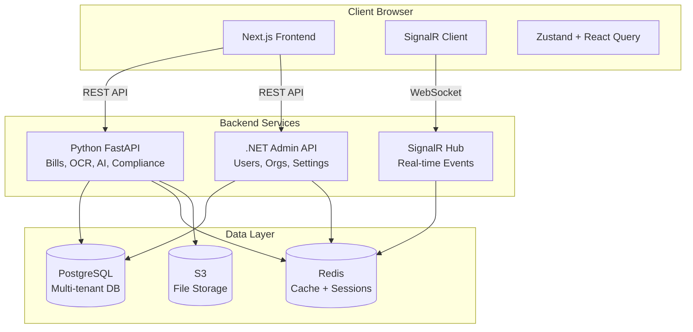
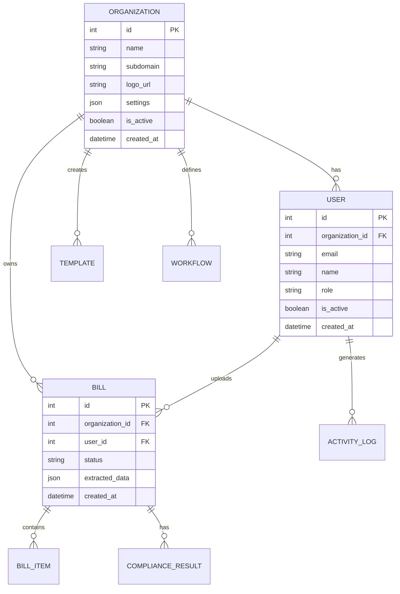
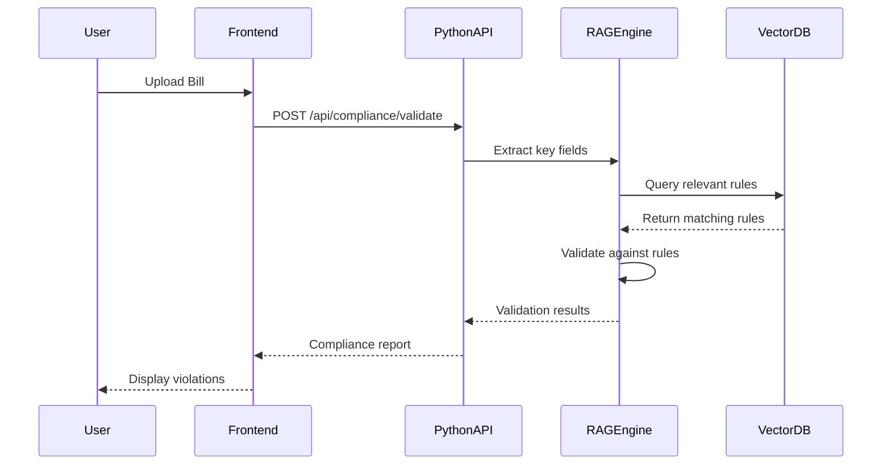

# Design Document: Frontend Missing Features

## Overview

This design document specifies the architecture and implementation details for completing the KiroTax AI Frontend. The system will integrate with the Python FastAPI backend and .NET Admin API to provide a comprehensive multi-tenant bill processing platform with organization-wise registration, AI-powered features, real-time notifications, and role-specific workflows.

### Key Design Principles

1. **Multi-tenant Architecture**: Organization-based isolation with shared infrastructure
2. **Real-time First**: SignalR integration for instant updates across all features
3. **Progressive Enhancement**: Core functionality works without JavaScript, enhanced with React
4. **API-First Design**: All features consume well-defined REST and SignalR APIs
5. **Role-Based UI**: Dynamic interfaces based on user role and organization permissions
6. **Offline Resilience**: Queue actions when offline, sync when connection restored

### Technology Stack

- **Framework**: Next.js 14 (App Router, Server Components)
- **UI Library**: React 18 with TypeScript
- **State Management**: Zustand (global state) + React Query (server state)
- **UI Components**: shadcn/ui + Radix UI primitives
- **Styling**: Tailwind CSS with custom design tokens
- **Real-time**: SignalR client for .NET hub connection
- **Charts**: Recharts for data visualization
- **Forms**: React Hook Form + Zod validation
- **File Upload**: React Dropzone with chunked uploads
- **PDF Generation**: jsPDF + html2canvas
- **Excel Export**: SheetJS (xlsx)
- **Testing**: Vitest + React Testing Library + Playwright

## Architecture

### System Context




### Multi-Tenant Organization Model

The system supports organization-wise registration where:
- Each organization has isolated data and settings
- Users belong to one organization
- Organizations can have custom templates, workflows, and branding
- Admin dashboard manages all organizations
- Cross-organization data access is prevented at API level



## Components and Interfaces

### 1. Organization Management Module

**Purpose**: Handle organization registration, settings, and multi-tenant isolation

**Components**:
- `OrganizationRegistrationForm`: Public registration for new organizations
- `OrganizationSettingsPanel`: Admin interface for org configuration
- `OrganizationSwitcher`: UI component for users with multi-org access
- `OrganizationBrandingEditor`: Customize logo, colors, and theme

**API Integration**:
```typescript
// Admin API Endpoints
POST   /api/admin/organizations          // Create new organization
GET    /api/admin/organizations          // List all organizations
GET    /api/admin/organizations/{id}     // Get organization details
PUT    /api/admin/organizations/{id}     // Update organization
DELETE /api/admin/organizations/{id}     // Deactivate organization
PUT    /api/admin/organizations/{id}/settings  // Update settings
```

**State Management**:
```typescript
interface OrganizationStore {
  currentOrg: Organization | null;
  organizations: Organization[];
  setCurrentOrg: (org: Organization) => void;
  fetchOrganizations: () => Promise<void>;
  updateOrgSettings: (id: number, settings: OrgSettings) => Promise<void>;
}
```


### 2. Compliance Module

**Purpose**: RAG-based compliance validation with visual violation display

**Components**:
- `ComplianceChecker`: Main interface for running compliance checks
- `ComplianceResultsPanel`: Display violations by severity
- `ComplianceViolationCard`: Individual violation with regulation text
- `ComplianceHistoryTimeline`: Historical validation results
- `ComplianceReportExporter`: Generate PDF compliance reports

**API Integration**:
```typescript
// Python Backend Endpoints
POST   /api/compliance/validate           // Validate bill against rules
GET    /api/compliance/rules              // Get compliance rules
GET    /api/compliance/history/{billId}   // Get validation history
POST   /api/compliance/explain            // Get AI explanation for rule
GET    /api/compliance/report/{billId}    // Generate compliance report
```

**Data Flow**:


**State Management**:
```typescript
interface ComplianceStore {
  validationResults: Map<number, ComplianceResult>;
  isValidating: boolean;
  validateBill: (billId: number) => Promise<ComplianceResult>;
  getHistory: (billId: number) => Promise<ComplianceHistory[]>;
  exportReport: (billId: number) => Promise<Blob>;
}

interface ComplianceResult {
  billId: number;
  status: 'pass' | 'fail' | 'warning';
  violations: Violation[];
  validatedAt: Date;
}

interface Violation {
  severity: 'critical' | 'warning' | 'info';
  rule: string;
  description: string;
  regulationText: string;
  suggestedFix: string;
  fieldPath: string;
}
```

### 3. Gemini AI Integration Module

**Purpose**: Smart field extraction and conversational bill queries

**Components**:
- `AIFieldExtractor`: Enhanced OCR with confidence scores
- `AIChat`: Conversational interface for bill queries
- `AIFieldSuggestions`: Display and accept/reject AI suggestions
- `ConfidenceIndicator`: Visual confidence score display
- `AIExtractionHistory`: Track AI extraction attempts

**API Integration**:
```typescript
// Python Backend Endpoints
POST   /api/gemini/extract                // Extract fields with AI
POST   /api/gemini/chat                   // Conversational query
GET    /api/gemini/chat/history           // Get chat history
POST   /api/gemini/suggest-corrections    // Get field corrections
```

**Real-time Streaming**:
```typescript
// Stream AI responses using Server-Sent Events
async function* streamAIResponse(query: string) {
  const response = await fetch('/api/gemini/chat', {
    method: 'POST',
    body: JSON.stringify({ query }),
    headers: { 'Accept': 'text/event-stream' }
  });
  
  const reader = response.body.getReader();
  const decoder = new TextDecoder();
  
  while (true) {
    const { done, value } = await reader.read();
    if (done) break;
    yield decoder.decode(value);
  }
}
```

**State Management**:
```typescript
interface GeminiStore {
  chatHistory: ChatMessage[];
  extractionResults: Map<number, ExtractionResult>;
  isExtracting: boolean;
  isStreaming: boolean;
  extractFields: (billId: number) => Promise<ExtractionResult>;
  sendChatMessage: (message: string) => AsyncGenerator<string>;
  acceptSuggestion: (billId: number, field: string) => Promise<void>;
}

interface ExtractionResult {
  billId: number;
  fields: ExtractedField[];
  confidence: number;
  extractedAt: Date;
}

interface ExtractedField {
  name: string;
  value: any;
  confidence: number;
  suggested: boolean;
  accepted: boolean;
}
```


### 4. Mapper Module

**Purpose**: Visual field mapping and transformation between bill formats

**Components**:
- `FieldMappingCanvas`: Drag-and-drop visual mapper
- `MappingRuleEditor`: Define transformation rules
- `MappingTemplateLibrary`: Reusable mapping configurations
- `MappingPreview`: Before/after comparison
- `MappingValidator`: Validate mapping rules

**API Integration**:
```typescript
// Python Backend Endpoints
POST   /api/mapper/create                 // Create mapping rule
GET    /api/mapper/templates              // Get mapping templates
POST   /api/mapper/apply                  // Apply mapping to bill
POST   /api/mapper/test                   // Test mapping with sample data
PUT    /api/mapper/templates/{id}         // Update mapping template
DELETE /api/mapper/templates/{id}         // Delete mapping template
```

**Mapping Configuration**:
```typescript
interface MappingTemplate {
  id: number;
  name: string;
  sourceSchema: FieldSchema;
  targetSchema: FieldSchema;
  rules: MappingRule[];
  organizationId: number;
}

interface MappingRule {
  sourceField: string;
  targetField: string;
  transformation?: TransformFunction;
  defaultValue?: any;
  required: boolean;
}

interface FieldSchema {
  fields: FieldDefinition[];
}

interface FieldDefinition {
  name: string;
  type: 'string' | 'number' | 'date' | 'boolean' | 'array' | 'object';
  required: boolean;
  validation?: ValidationRule[];
}
```

### 5. Tender Management Module

**Purpose**: Process government tenders and track responses

**Components**:
- `TenderUploader`: Upload tender documents
- `TenderDetailsViewer`: Display extracted tender information
- `TenderStatusTracker`: Track tender lifecycle
- `TenderResponseBuilder`: Create tender responses
- `TenderDeadlineAlert`: Deadline warnings and notifications

**API Integration**:
```typescript
// Python Backend Endpoints
POST   /api/tenders/upload                // Upload tender document
GET    /api/tenders                       // List tenders
GET    /api/tenders/{id}                  // Get tender details
PUT    /api/tenders/{id}/status           // Update tender status
POST   /api/tenders/{id}/response         // Submit tender response
POST   /api/tenders/{id}/attach           // Attach supporting documents
```

**State Management**:
```typescript
interface TenderStore {
  tenders: Tender[];
  selectedTender: Tender | null;
  uploadTender: (file: File) => Promise<Tender>;
  updateStatus: (id: number, status: TenderStatus) => Promise<void>;
  submitResponse: (id: number, response: TenderResponse) => Promise<void>;
}

interface Tender {
  id: number;
  title: string;
  referenceNumber: string;
  deadline: Date;
  requirements: string[];
  financialDetails: FinancialDetails;
  status: TenderStatus;
  extractedData: any;
  attachments: Attachment[];
}

type TenderStatus = 'new' | 'in-progress' | 'submitted' | 'awarded' | 'rejected';
```

### 6. CA Workflow Automation Module

**Purpose**: Automated approval workflows with real-time notifications

**Components**:
- `WorkflowDashboard`: Overview of pending approvals
- `WorkflowRuleBuilder`: Define custom workflow rules
- `ApprovalQueue`: List of items requiring approval
- `BulkApprovalPanel`: Approve multiple items
- `WorkflowHistoryViewer`: Track approval history

**API Integration**:
```typescript
// Python Backend Endpoints
POST   /api/workflows/create              // Create workflow rule
GET    /api/workflows                     // List workflows
POST   /api/workflows/{id}/approve        // Approve item
POST   /api/workflows/{id}/reject         // Reject item
POST   /api/workflows/bulk-approve        // Bulk approve items
GET    /api/workflows/history/{billId}    // Get approval history

// SignalR Events
onWorkflowNotification(notification: WorkflowNotification)
onApprovalRequired(approval: ApprovalRequest)
onApprovalCompleted(result: ApprovalResult)
```

**Workflow Engine**:
```typescript
interface WorkflowRule {
  id: number;
  name: string;
  conditions: WorkflowCondition[];
  approvers: ApproverConfig[];
  organizationId: number;
  isActive: boolean;
}

interface WorkflowCondition {
  field: string;
  operator: 'equals' | 'greater_than' | 'less_than' | 'contains';
  value: any;
}

interface ApproverConfig {
  userId?: number;
  role?: string;
  order: number;
  required: boolean;
}

interface ApprovalRequest {
  id: number;
  billId: number;
  workflowId: number;
  requestedBy: number;
  assignedTo: number;
  status: 'pending' | 'approved' | 'rejected';
  comments?: string;
  createdAt: Date;
}
```


### 7. Real-time Notifications Module

**Purpose**: SignalR-based real-time notifications with toast display

**Components**:
- `NotificationProvider`: SignalR connection manager
- `NotificationCenter`: Notification inbox
- `ToastNotification`: Temporary notification display
- `NotificationPreferences`: User notification settings
- `ConnectionStatusIndicator`: SignalR connection status

**SignalR Integration**:
```typescript
// SignalR Hub Connection
class NotificationHub {
  private connection: HubConnection;
  
  async connect(token: string) {
    this.connection = new HubConnectionBuilder()
      .withUrl('/adminHub', {
        accessTokenFactory: () => token
      })
      .withAutomaticReconnect()
      .build();
    
    this.connection.on('ReceiveNotification', this.handleNotification);
    this.connection.on('BillProcessed', this.handleBillProcessed);
    this.connection.on('ApprovalRequired', this.handleApprovalRequired);
    this.connection.on('ComplianceAlert', this.handleComplianceAlert);
    
    await this.connection.start();
  }
  
  async disconnect() {
    await this.connection.stop();
  }
}
```

**Notification Types**:
```typescript
interface Notification {
  id: string;
  type: NotificationType;
  title: string;
  message: string;
  severity: 'info' | 'success' | 'warning' | 'error';
  actionUrl?: string;
  actionLabel?: string;
  read: boolean;
  createdAt: Date;
}

type NotificationType = 
  | 'bill_processed'
  | 'approval_required'
  | 'approval_completed'
  | 'compliance_alert'
  | 'tender_deadline'
  | 'template_approved'
  | 'user_invited'
  | 'system_alert';

interface NotificationPreferences {
  userId: number;
  emailEnabled: boolean;
  pushEnabled: boolean;
  soundEnabled: boolean;
  types: Record<NotificationType, boolean>;
}
```

**State Management**:
```typescript
interface NotificationStore {
  notifications: Notification[];
  unreadCount: number;
  isConnected: boolean;
  preferences: NotificationPreferences;
  addNotification: (notification: Notification) => void;
  markAsRead: (id: string) => Promise<void>;
  markAllAsRead: () => Promise<void>;
  updatePreferences: (prefs: NotificationPreferences) => Promise<void>;
}
```

### 8. Advanced Reporting Module

**Purpose**: Interactive charts, analytics, and export capabilities

**Components**:
- `ReportBuilder`: Configure report parameters
- `DashboardCharts`: Interactive chart components
- `ReportExporter`: Export to PDF/Excel
- `MetricCards`: Key performance indicators
- `ReportTemplateLibrary`: Saved report configurations

**API Integration**:
```typescript
// Python Backend Endpoints
POST   /api/reports/generate              // Generate report data
GET    /api/reports/templates             // Get report templates
POST   /api/reports/export/pdf            // Export as PDF
POST   /api/reports/export/excel          // Export as Excel
POST   /api/reports/schedule              // Schedule automated reports
GET    /api/reports/metrics               // Get dashboard metrics
```

**Chart Types**:
```typescript
interface ChartConfig {
  type: 'bar' | 'line' | 'pie' | 'area' | 'scatter' | 'radar';
  data: ChartData[];
  xAxis: AxisConfig;
  yAxis: AxisConfig;
  legend: LegendConfig;
  colors: string[];
}

interface ReportConfig {
  name: string;
  filters: ReportFilter[];
  charts: ChartConfig[];
  metrics: MetricConfig[];
  exportFormat: 'pdf' | 'excel' | 'csv';
}

interface ReportFilter {
  field: string;
  operator: string;
  value: any;
}

interface MetricConfig {
  name: string;
  aggregation: 'sum' | 'avg' | 'count' | 'min' | 'max';
  field: string;
  format: 'number' | 'currency' | 'percentage';
}
```

**Export Implementation**:
```typescript
// PDF Export using jsPDF
async function exportToPDF(report: Report): Promise<Blob> {
  const pdf = new jsPDF();
  
  // Add header
  pdf.setFontSize(20);
  pdf.text(report.title, 20, 20);
  
  // Add charts as images
  for (const chart of report.charts) {
    const canvas = await html2canvas(chart.element);
    const imgData = canvas.toDataURL('image/png');
    pdf.addImage(imgData, 'PNG', 20, 40, 170, 100);
    pdf.addPage();
  }
  
  return pdf.output('blob');
}

// Excel Export using SheetJS
async function exportToExcel(report: Report): Promise<Blob> {
  const workbook = XLSX.utils.book_new();
  
  // Add data sheet
  const worksheet = XLSX.utils.json_to_sheet(report.data);
  XLSX.utils.book_append_sheet(workbook, worksheet, 'Data');
  
  // Add summary sheet
  const summarySheet = XLSX.utils.json_to_sheet(report.metrics);
  XLSX.utils.book_append_sheet(workbook, summarySheet, 'Summary');
  
  const excelBuffer = XLSX.write(workbook, { bookType: 'xlsx', type: 'array' });
  return new Blob([excelBuffer], { type: 'application/vnd.openxmlformats-officedocument.spreadsheetml.sheet' });
}
```


### 9. Role-specific Dashboards Module

**Purpose**: Customized dashboards for CA, Auditor, and Client roles

**Components**:
- `CADashboard`: CA-specific metrics and actions
- `AuditorDashboard`: Audit-focused interface
- `ClientDashboard`: Client portal view
- `DashboardWidgetLibrary`: Reusable dashboard widgets
- `DashboardCustomizer`: Drag-and-drop dashboard editor

**Dashboard Configurations**:
```typescript
interface DashboardConfig {
  role: 'ca' | 'auditor' | 'client';
  widgets: WidgetConfig[];
  layout: LayoutConfig;
}

interface WidgetConfig {
  id: string;
  type: WidgetType;
  position: { x: number; y: number; w: number; h: number };
  config: any;
}

type WidgetType = 
  | 'metric_card'
  | 'chart'
  | 'recent_activity'
  | 'pending_approvals'
  | 'compliance_status'
  | 'quick_actions'
  | 'notifications'
  | 'client_list';

// CA Dashboard Widgets
const caWidgets: WidgetType[] = [
  'metric_card',        // Total clients, revenue, bills processed
  'chart',              // Revenue trends, bill status distribution
  'pending_approvals',  // Bills awaiting approval
  'recent_activity',    // Recent client actions
  'client_list',        // Active clients
  'quick_actions'       // Upload bill, create client, run report
];

// Auditor Dashboard Widgets
const auditorWidgets: WidgetType[] = [
  'metric_card',        // Bills audited, compliance rate
  'compliance_status',  // Compliance violations by severity
  'chart',              // Audit trends
  'recent_activity',    // Recent audit actions
  'quick_actions'       // Start audit, view reports
];

// Client Dashboard Widgets
const clientWidgets: WidgetType[] = [
  'metric_card',        // Total bills, pending payments
  'chart',              // Tax summary, expense trends
  'recent_activity',    // Recent bill uploads
  'notifications',      // Important alerts
  'quick_actions'       // Upload bill, download report
];
```

**API Integration**:
```typescript
// Python Backend Endpoints
GET    /api/dashboard/ca                  // Get CA dashboard data
GET    /api/dashboard/auditor             // Get auditor dashboard data
GET    /api/dashboard/client              // Get client dashboard data
PUT    /api/dashboard/layout              // Save dashboard layout
GET    /api/dashboard/widgets             // Get available widgets
```

### 10. Template Marketplace Module

**Purpose**: Browse, rate, and purchase bill templates

**Components**:
- `TemplateMarketplace`: Browse templates with filters
- `TemplateDetailView`: Template preview and details
- `TemplateRatingSystem`: Rate and review templates
- `TemplatePurchaseFlow`: Purchase and download templates
- `MyTemplatesLibrary`: User's purchased templates

**API Integration**:
```typescript
// Python Backend Endpoints
GET    /api/templates/marketplace         // List marketplace templates
GET    /api/templates/{id}                // Get template details
POST   /api/templates/{id}/purchase       // Purchase template
POST   /api/templates/{id}/rate           // Rate template
GET    /api/templates/my-templates        // Get user's templates
POST   /api/templates/submit              // Submit new template

// Admin API Endpoints
GET    /api/admin/templates/pending       // Get pending approvals
PUT    /api/admin/templates/{id}/approve  // Approve template
PUT    /api/admin/templates/{id}/reject   // Reject template
```

**Template Structure**:
```typescript
interface MarketplaceTemplate {
  id: number;
  name: string;
  description: string;
  category: TemplateCategory;
  price: number;
  currency: string;
  previewUrl: string;
  creatorId: number;
  creatorName: string;
  rating: number;
  ratingCount: number;
  downloadCount: number;
  status: 'pending_review' | 'published' | 'rejected';
  tags: string[];
  createdAt: Date;
}

type TemplateCategory = 
  | 'invoice'
  | 'receipt'
  | 'purchase_order'
  | 'tax_form'
  | 'expense_report'
  | 'custom';

interface TemplateRating {
  templateId: number;
  userId: number;
  rating: number;
  review?: string;
  createdAt: Date;
}
```

### 11. Audit Trail Viewer Module

**Purpose**: Comprehensive activity logging with filtering

**Components**:
- `AuditLogTable`: Paginated activity log display
- `AuditLogFilters`: Advanced filtering interface
- `AuditLogDetailModal`: Detailed log entry view
- `AuditLogTimeline`: Chronological timeline view
- `AuditLogExporter`: Export logs to CSV/PDF

**API Integration**:
```typescript
// Admin API Endpoints
GET    /api/admin/activity                // Get activity logs
GET    /api/admin/activity/{id}           // Get log details
POST   /api/admin/activity/export         // Export logs
GET    /api/admin/activity/timeline       // Get timeline view
```

**Log Structure**:
```typescript
interface ActivityLog {
  id: number;
  action: string;
  description: string;
  userId: number;
  userName: string;
  organizationId: number;
  entityType: string;
  entityId: number;
  changes?: ChangeRecord[];
  ipAddress: string;
  userAgent: string;
  severity: 'info' | 'warning' | 'error' | 'critical';
  timestamp: Date;
}

interface ChangeRecord {
  field: string;
  oldValue: any;
  newValue: any;
}

interface AuditLogFilter {
  dateRange?: { start: Date; end: Date };
  userId?: number;
  actionType?: string[];
  entityType?: string[];
  severity?: string[];
  searchTerm?: string;
}
```


### 12. Bulk Operations Module

**Purpose**: Efficient batch processing of multiple bills

**Components**:
- `BulkSelectionToolbar`: Multi-select interface
- `BulkActionMenu`: Available bulk operations
- `BulkUploadZone`: Drag-and-drop multiple files
- `BulkProgressTracker`: Real-time progress display
- `BulkResultsSummary`: Success/failure report

**API Integration**:
```typescript
// Python Backend Endpoints
POST   /api/bills/bulk-upload             // Upload multiple bills
POST   /api/bills/bulk-approve            // Approve multiple bills
POST   /api/bills/bulk-reject             // Reject multiple bills
POST   /api/bills/bulk-delete             // Delete multiple bills
POST   /api/bills/bulk-export             // Export multiple bills
POST   /api/bills/bulk-assign             // Assign multiple bills
```

**Bulk Processing**:
```typescript
interface BulkOperation {
  id: string;
  type: BulkOperationType;
  itemIds: number[];
  status: 'pending' | 'processing' | 'completed' | 'failed';
  progress: number;
  results: BulkOperationResult[];
  startedAt: Date;
  completedAt?: Date;
}

type BulkOperationType = 
  | 'upload'
  | 'approve'
  | 'reject'
  | 'delete'
  | 'export'
  | 'assign';

interface BulkOperationResult {
  itemId: number;
  success: boolean;
  error?: string;
}

// Chunked processing for large batches
async function processBulkOperation(
  operation: BulkOperation,
  chunkSize: number = 10
): Promise<BulkOperationResult[]> {
  const results: BulkOperationResult[] = [];
  const chunks = chunkArray(operation.itemIds, chunkSize);
  
  for (let i = 0; i < chunks.length; i++) {
    const chunk = chunks[i];
    const chunkResults = await processChunk(operation.type, chunk);
    results.push(...chunkResults);
    
    // Update progress
    const progress = ((i + 1) / chunks.length) * 100;
    updateProgress(operation.id, progress);
  }
  
  return results;
}
```

### 13. Document Generator Module

**Purpose**: Generate professional documents from bill data

**Components**:
- `DocumentTemplateSelector`: Choose document template
- `DocumentPreview`: Live preview with data
- `DocumentCustomizer`: Customize branding and layout
- `DocumentGenerator`: Generate PDF documents
- `DocumentHistory`: Track generated documents

**API Integration**:
```typescript
// Python Backend Endpoints
GET    /api/documents/templates           // Get document templates
POST   /api/documents/generate            // Generate document
POST   /api/documents/batch-generate      // Generate multiple documents
GET    /api/documents/history             // Get generation history
POST   /api/documents/email               // Email generated document
```

**Document Templates**:
```typescript
interface DocumentTemplate {
  id: number;
  name: string;
  type: DocumentType;
  layout: LayoutConfig;
  styles: StyleConfig;
  sections: DocumentSection[];
}

type DocumentType = 
  | 'invoice'
  | 'tax_report'
  | 'compliance_certificate'
  | 'expense_summary'
  | 'audit_report';

interface DocumentSection {
  id: string;
  type: 'header' | 'body' | 'footer' | 'table' | 'chart';
  content: string | object;
  dataBinding?: string;
  styles?: CSSProperties;
}

interface GenerateDocumentRequest {
  templateId: number;
  billIds: number[];
  customization?: {
    logo?: string;
    colors?: Record<string, string>;
    footer?: string;
  };
  format: 'pdf' | 'html';
}
```

### 14. Change Tracking Module

**Purpose**: Track and visualize bill modifications

**Components**:
- `ChangeHistoryPanel`: Display all modifications
- `DiffViewer`: Side-by-side comparison
- `VersionSelector`: Navigate between versions
- `ChangeRevertDialog`: Revert to previous version
- `ChangeNotificationBadge`: Indicate modified fields

**API Integration**:
```typescript
// Python Backend Endpoints
GET    /api/bills/{id}/history            // Get change history
GET    /api/bills/{id}/versions           // Get all versions
GET    /api/bills/{id}/diff               // Compare versions
POST   /api/bills/{id}/revert             // Revert to version
```

**Change Tracking**:
```typescript
interface BillVersion {
  id: number;
  billId: number;
  version: number;
  data: any;
  changedBy: number;
  changedAt: Date;
  changes: FieldChange[];
  comment?: string;
}

interface FieldChange {
  field: string;
  oldValue: any;
  newValue: any;
  changeType: 'added' | 'modified' | 'deleted';
}

interface DiffResult {
  billId: number;
  fromVersion: number;
  toVersion: number;
  changes: FieldChange[];
  summary: {
    added: number;
    modified: number;
    deleted: number;
  };
}
```

### 15. Search and Filters Module

**Purpose**: Global search with advanced filtering

**Components**:
- `GlobalSearchBar`: Omnisearch with autocomplete
- `AdvancedFilterPanel`: Multi-criteria filtering
- `SearchResultsView`: Grouped search results
- `SavedSearches`: Favorite search queries
- `SearchSuggestions`: Smart search suggestions

**API Integration**:
```typescript
// Python Backend Endpoints
GET    /api/search                        // Global search
GET    /api/search/suggestions            // Get autocomplete suggestions
POST   /api/search/advanced               // Advanced search with filters
POST   /api/search/save                   // Save search query
GET    /api/search/saved                  // Get saved searches
```

**Search Implementation**:
```typescript
interface SearchQuery {
  term: string;
  filters: SearchFilter[];
  entityTypes?: EntityType[];
  sortBy?: string;
  sortOrder?: 'asc' | 'desc';
  page: number;
  pageSize: number;
}

interface SearchFilter {
  field: string;
  operator: FilterOperator;
  value: any;
}

type FilterOperator = 
  | 'equals'
  | 'not_equals'
  | 'contains'
  | 'starts_with'
  | 'ends_with'
  | 'greater_than'
  | 'less_than'
  | 'between'
  | 'in'
  | 'not_in';

type EntityType = 'bill' | 'client' | 'template' | 'tender' | 'user';

interface SearchResult {
  entityType: EntityType;
  entityId: number;
  title: string;
  description: string;
  highlights: string[];
  score: number;
}

interface SearchResponse {
  results: SearchResult[];
  total: number;
  facets: Record<string, FacetResult[]>;
  suggestions: string[];
}
```


### 16. Settings Management Module

**Purpose**: User preferences and system configuration

**Components**:
- `SettingsLayout`: Tabbed settings interface
- `ProfileSettings`: User profile management
- `NotificationSettings`: Notification preferences
- `AppearanceSettings`: Theme and display options
- `SecuritySettings`: Password and 2FA management
- `OrganizationSettings`: Organization-level configuration (admin only)

**API Integration**:
```typescript
// Admin API Endpoints
GET    /api/admin/settings                // Get system settings
PUT    /api/admin/settings                // Update system settings
GET    /api/users/{id}/preferences        // Get user preferences
PUT    /api/users/{id}/preferences        // Update user preferences
```

**Settings Structure**:
```typescript
interface UserPreferences {
  userId: number;
  theme: 'light' | 'dark' | 'system';
  language: string;
  timezone: string;
  dateFormat: string;
  numberFormat: string;
  notifications: NotificationPreferences;
  defaultFilters: Record<string, any>;
  dashboardLayout: DashboardConfig;
}

interface SystemSettings {
  organizationId: number;
  branding: BrandingConfig;
  features: FeatureFlags;
  integrations: IntegrationConfig;
  security: SecurityConfig;
  billing: BillingConfig;
}

interface BrandingConfig {
  logo: string;
  primaryColor: string;
  secondaryColor: string;
  favicon: string;
  customCSS?: string;
}

interface FeatureFlags {
  aiExtraction: boolean;
  complianceValidation: boolean;
  tenderManagement: boolean;
  templateMarketplace: boolean;
  bulkOperations: boolean;
  advancedReporting: boolean;
}
```

## Data Models

### Core Entities

```typescript
// Organization
interface Organization {
  id: number;
  name: string;
  subdomain: string;
  logoUrl?: string;
  settings: OrganizationSettings;
  isActive: boolean;
  createdAt: Date;
  updatedAt: Date;
}

interface OrganizationSettings {
  timezone: string;
  currency: string;
  dateFormat: string;
  features: FeatureFlags;
  branding: BrandingConfig;
  limits: {
    maxUsers: number;
    maxBillsPerMonth: number;
    maxStorageGB: number;
  };
}

// User (Extended)
interface User {
  id: number;
  organizationId: number;
  email: string;
  name: string;
  role: UserRole;
  permissions: Permission[];
  isActive: boolean;
  preferences: UserPreferences;
  lastLoginAt?: Date;
  createdAt: Date;
  updatedAt: Date;
}

type UserRole = 'admin' | 'ca' | 'auditor' | 'client';

interface Permission {
  resource: string;
  actions: ('create' | 'read' | 'update' | 'delete')[];
}

// Bill (Extended)
interface Bill {
  id: number;
  organizationId: number;
  userId: number;
  fileName: string;
  fileUrl: string;
  status: BillStatus;
  extractedData: ExtractedBillData;
  complianceStatus?: ComplianceStatus;
  workflowStatus?: WorkflowStatus;
  version: number;
  createdAt: Date;
  updatedAt: Date;
  processedAt?: Date;
}

type BillStatus = 'uploaded' | 'processing' | 'processed' | 'failed' | 'approved' | 'rejected';

interface ExtractedBillData {
  invoiceNumber?: string;
  invoiceDate?: Date;
  vendorName?: string;
  vendorGSTIN?: string;
  items: BillItem[];
  subtotal: number;
  gstAmount: number;
  grandTotal: number;
  confidence: number;
  extractionMethod: 'ocr' | 'gemini' | 'manual';
}

type ComplianceStatus = 'pending' | 'pass' | 'fail' | 'warning';
type WorkflowStatus = 'pending' | 'in_review' | 'approved' | 'rejected';
```

### Supporting Entities

```typescript
// Notification
interface Notification {
  id: string;
  organizationId: number;
  userId: number;
  type: NotificationType;
  title: string;
  message: string;
  severity: 'info' | 'success' | 'warning' | 'error';
  actionUrl?: string;
  actionLabel?: string;
  read: boolean;
  createdAt: Date;
  expiresAt?: Date;
}

// Report
interface Report {
  id: number;
  organizationId: number;
  userId: number;
  name: string;
  config: ReportConfig;
  data: any;
  generatedAt: Date;
  expiresAt?: Date;
}

// Workflow
interface Workflow {
  id: number;
  organizationId: number;
  name: string;
  description?: string;
  rules: WorkflowRule[];
  isActive: boolean;
  createdBy: number;
  createdAt: Date;
  updatedAt: Date;
}

// Mapping Template
interface MappingTemplate {
  id: number;
  organizationId: number;
  name: string;
  description?: string;
  sourceSchema: FieldSchema;
  targetSchema: FieldSchema;
  rules: MappingRule[];
  isPublic: boolean;
  createdBy: number;
  createdAt: Date;
  updatedAt: Date;
}

// Tender
interface Tender {
  id: number;
  organizationId: number;
  userId: number;
  title: string;
  referenceNumber: string;
  deadline: Date;
  requirements: string[];
  financialDetails: {
    estimatedValue: number;
    currency: string;
    paymentTerms: string;
  };
  status: TenderStatus;
  extractedData: any;
  attachments: Attachment[];
  response?: TenderResponse;
  createdAt: Date;
  updatedAt: Date;
}

interface TenderResponse {
  id: number;
  tenderId: number;
  content: string;
  attachments: Attachment[];
  submittedBy: number;
  submittedAt: Date;
}

// Attachment
interface Attachment {
  id: number;
  fileName: string;
  fileUrl: string;
  fileSize: number;
  mimeType: string;
  uploadedBy: number;
  uploadedAt: Date;
}
```


## Correctness Properties

A property is a characteristic or behavior that should hold true across all valid executions of a system—essentially, a formal statement about what the system should do. Properties serve as the bridge between human-readable specifications and machine-verifiable correctness guarantees.

### Property Reflection

After analyzing all 140 acceptance criteria, I identified several areas of redundancy that can be consolidated:

1. **API Integration Properties**: Many criteria test "call API endpoint X and display result Y" - these can be consolidated into general API integration properties
2. **Display Properties**: Multiple criteria test "display data with correct formatting" - can be combined into data display properties
3. **Real-time Update Properties**: Several criteria test SignalR updates - can be unified
4. **Export Properties**: Multiple export formats (PDF, Excel, CSV) can be tested with a single property
5. **Validation Properties**: Form validation and error display can be consolidated
6. **Navigation Properties**: Click actions that navigate can be combined

### Core Properties


Property 1: API Integration Consistency
*For any* API endpoint call, the Frontend should send requests with correct parameters, handle responses appropriately, and display results or errors to the user
**Validates: Requirements 1.1, 1.4, 2.1, 2.3, 3.2, 4.1, 9.4, 9.6, 10.1, 12.5, 12.7, 16.2, 16.5**

Property 2: Data Categorization and Grouping
*For any* collection of items with categories or severity levels, the Frontend should correctly group and display them by their classification
**Validates: Requirements 1.2, 8.1, 8.2, 8.3, 14.4**

Property 3: Interactive Element Response
*For any* clickable element (button, link, card), when clicked, the Frontend should trigger the appropriate action (navigation, modal, API call) and provide visual feedback
**Validates: Requirements 1.3, 6.4, 10.3, 13.4**

Property 4: Export Functionality
*For any* data export request in any supported format (PDF, Excel, CSV), the Frontend should generate a file containing the filtered data with proper formatting
**Validates: Requirements 1.5, 7.4, 10.4, 12.4, 19.1, 19.2**

Property 5: Historical Data Display
*For any* entity with historical records, the Frontend should fetch and display the complete history in chronological order with relevant metadata
**Validates: Requirements 1.6, 2.4, 5.6, 10.6, 13.1**

Property 6: Conditional UI State
*For any* UI element with conditional visibility or enablement, the Frontend should show/hide or enable/disable the element based on the current state
**Validates: Requirements 1.7, 2.7, 4.4, 5.7, 11.2, 16.7**

Property 7: Confidence Score Visualization
*For any* AI-extracted field with a confidence score, the Frontend should display the score with appropriate visual indicators (color, icon, or badge) based on confidence thresholds
**Validates: Requirements 2.1, 2.6**

Property 8: Real-time Streaming
*For any* streaming API response, the Frontend should display chunks of data as they arrive without waiting for the complete response
**Validates: Requirements 2.3**

Property 9: Field Suggestion Workflow
*For any* AI-suggested field correction, the Frontend should allow the user to accept or reject the suggestion and update the field value accordingly
**Validates: Requirements 2.5**

Property 10: Visual Mapping Interface
*For any* mapping between source and target schemas, the Frontend should display both schemas side-by-side and allow creating connections between fields
**Validates: Requirements 3.1, 3.4**

Property 11: Mapping Validation
*For any* mapping rule, the Frontend should validate field type compatibility and required field presence before allowing the mapping to be saved
**Validates: Requirements 3.6**

Property 12: Smart Template Suggestion
*For any* bill import, the Frontend should analyze the bill format and suggest applicable mapping templates based on field structure similarity
**Validates: Requirements 3.7**

Property 13: Transformation Preview
*For any* mapping applied to sample data, the Frontend should display the transformed output alongside the original input for comparison
**Validates: Requirements 3.3, 3.4**

Property 14: Status Tracking
*For any* entity with a status field (bill, tender, workflow), the Frontend should display the current status and allow authorized users to update it
**Validates: Requirements 4.3, 5.1, 5.4**

Property 15: Deadline Warning System
*For any* entity with a deadline, when the deadline is within a configurable threshold, the Frontend should display visual warnings and trigger notifications
**Validates: Requirements 4.4**

Property 16: Document Attachment
*For any* entity supporting attachments, the Frontend should allow uploading files, display attached files, and provide download functionality
**Validates: Requirements 4.6**

Property 17: Receipt Generation
*For any* submission action, the Frontend should generate a receipt containing timestamp, reference number, and submission details
**Validates: Requirements 4.7**

Property 18: SignalR Connection Management
*For any* page load, the Frontend should establish a SignalR connection, handle reconnection on failure, and display connection status
**Validates: Requirements 6.1, 6.6**

Property 19: Real-time Notification Display
*For any* notification received via SignalR, the Frontend should display a toast with appropriate styling based on notification type and severity
**Validates: Requirements 5.2, 6.2**

Property 20: Notification State Management
*For any* notification, the Frontend should track read/unread status, allow marking as read, and persist the state
**Validates: Requirements 6.3, 6.4**

Property 21: User Preference Persistence
*For any* user preference setting, when updated, the Frontend should save it to the backend and apply the change immediately to the UI
**Validates: Requirements 6.5, 15.2, 15.3, 15.4, 15.5, 15.6, 15.7**

Property 22: Conditional Sound Alerts
*For any* critical notification, if user preferences allow sound, the Frontend should play an audio alert
**Validates: Requirements 6.7**

Property 23: Chart Rendering
*For any* report configuration with chart specifications, the Frontend should render interactive charts of the specified type with correct data
**Validates: Requirements 7.2, 7.3**

Property 24: Template Persistence
*For any* configuration (report, search, mapping), the Frontend should allow saving as a template and reusing it later
**Validates: Requirements 3.5, 7.5, 14.5**

Property 25: Metric Display
*For any* dashboard or report, the Frontend should calculate and display key metrics with appropriate formatting (currency, percentage, number)
**Validates: Requirements 7.6**

Property 26: Automatic Refresh
*For any* data display with real-time updates enabled, when underlying data changes, the Frontend should refresh the display without full page reload
**Validates: Requirements 7.7, 8.6, 10.7**

Property 27: Role-based Dashboard Content
*For any* user role, when logging in, the Frontend should display a dashboard with widgets and actions appropriate to that role
**Validates: Requirements 8.1, 8.2, 8.3, 8.7**

Property 28: Dashboard Customization
*For any* dashboard widget, users should be able to add, remove, or rearrange widgets, and the Frontend should persist these customizations
**Validates: Requirements 8.4, 8.5**

Property 29: Template Detail Display
*For any* marketplace template, when viewed, the Frontend should display all relevant information including preview, rating, price, and usage statistics
**Validates: Requirements 9.2**

Property 30: Rating and Review System
*For any* purchased template, users should be able to submit a rating and review, which updates the template's average rating
**Validates: Requirements 9.3**

Property 31: Purchase Flow
*For any* template purchase, the Frontend should process the payment, add the template to the user's library, and confirm the transaction
**Validates: Requirements 9.4, 9.5**

Property 32: Approval Workflow
*For any* item requiring approval (template, bill), the Frontend should display approval status and allow authorized users to approve or reject
**Validates: Requirements 9.7**

Property 33: Paginated Data Display
*For any* large dataset, the Frontend should display data in pages with navigation controls and maintain filter/sort state across pages
**Validates: Requirements 10.1**

Property 34: Multi-criteria Filtering
*For any* filterable list, the Frontend should support multiple simultaneous filters and update results to match all active filters
**Validates: Requirements 10.2, 14.3**

Property 35: Detail View Expansion
*For any* list item, when clicked, the Frontend should display detailed information including related data and change history
**Validates: Requirements 10.3**

Property 36: Anomaly Highlighting
*For any* suspicious or unusual activity, the Frontend should apply visual indicators (color, icon, badge) to draw attention
**Validates: Requirements 10.5, 13.7**

Property 37: Timeline Visualization
*For any* sequence of related events, the Frontend should display them in a chronological timeline with timestamps and descriptions
**Validates: Requirements 10.6**

Property 38: Multi-select Interface
*For any* list view, the Frontend should provide checkboxes for selecting multiple items and display selected count
**Validates: Requirements 11.1**

Property 39: Bulk Operation Processing
*For any* bulk operation, the Frontend should process items in batches, display progress, and show a summary of results
**Validates: Requirements 11.3, 11.4, 11.5**

Property 40: Multi-file Upload
*For any* file upload interface, the Frontend should support selecting and uploading multiple files simultaneously with individual progress tracking
**Validates: Requirements 11.6, 11.7**

Property 41: Template Population
*For any* document template, when populated with data, the Frontend should replace all placeholders with actual values and display a preview
**Validates: Requirements 12.2**

Property 42: Template Customization
*For any* document template, users should be able to customize branding elements (logo, colors) and see changes reflected in the preview
**Validates: Requirements 12.3**

Property 43: Batch Document Generation
*For any* document generation request with multiple bills, the Frontend should generate documents for all bills using the same template
**Validates: Requirements 12.6**

Property 44: Change Recording
*For any* field modification, the Frontend should record the change with timestamp, user, old value, and new value
**Validates: Requirements 13.2**

Property 45: Diff Visualization
*For any* two versions of an entity, the Frontend should highlight differences between them with color coding (added, modified, deleted)
**Validates: Requirements 13.3**

Property 46: Version Revert
*For any* previous version, the Frontend should allow reverting to that version after user confirmation
**Validates: Requirements 13.4**

Property 47: User Attribution
*For any* change or action, the Frontend should display the user who performed it along with their profile information
**Validates: Requirements 13.5**

Property 48: History Filtering
*For any* change history, the Frontend should support filtering by date range, user, or field name
**Validates: Requirements 13.6**

Property 49: Autocomplete Suggestions
*For any* search input, as the user types, the Frontend should display autocomplete suggestions from multiple entity types
**Validates: Requirements 14.2**

Property 50: Search Term Highlighting
*For any* search result, the Frontend should highlight the search terms within the result text for easy identification
**Validates: Requirements 14.6**

Property 51: No Results Handling
*For any* search with zero results, the Frontend should display a helpful message and suggest alternative search terms or filters
**Validates: Requirements 14.7**

Property 52: Inline Validation
*For any* form field with validation rules, when the field loses focus or form is submitted, the Frontend should display inline error messages for invalid values
**Validates: Requirements 16.1**

Property 53: Client-side Validation
*For any* form submission, the Frontend should validate all fields against their rules before sending the request to the backend
**Validates: Requirements 16.3**

Property 54: Offline Handling
*For any* network error, the Frontend should display an offline indicator and queue actions for retry when connection is restored
**Validates: Requirements 16.4**

Property 55: Error Boundary Protection
*For any* component error, the Frontend should catch it with an error boundary and display a fallback UI instead of crashing
**Validates: Requirements 16.6**

Property 56: Virtual Scrolling
*For any* list with more than a threshold number of items, the Frontend should render only visible items using virtual scrolling
**Validates: Requirements 17.2**

Property 57: Response Caching
*For any* API response, the Frontend should cache it and serve from cache on subsequent requests until invalidation
**Validates: Requirements 17.3**

Property 58: Input Debouncing
*For any* search or filter input, the Frontend should debounce the input and only trigger API calls after the user stops typing
**Validates: Requirements 17.5**

Property 59: Loading State Display
*For any* data fetch operation, while loading, the Frontend should display skeleton loaders or spinners instead of blank content
**Validates: Requirements 17.6**

Property 60: Upload Progress Tracking
*For any* large file upload, the Frontend should display progress percentage and support resuming interrupted uploads
**Validates: Requirements 17.7**

Property 61: Keyboard Navigation
*For any* interactive element, users should be able to navigate to it and activate it using only keyboard
**Validates: Requirements 18.1**

Property 62: ARIA Attributes
*For any* UI component, the Frontend should include appropriate ARIA labels, roles, and properties for screen reader compatibility
**Validates: Requirements 18.2**

Property 63: Color Contrast
*For any* text or interactive element, the Frontend should maintain sufficient color contrast ratio to meet WCAG standards
**Validates: Requirements 18.3**

Property 64: Focus Indicators
*For any* focusable element, when it receives focus, the Frontend should display a visible focus indicator
**Validates: Requirements 18.4**

Property 65: Alternative Text
*For any* image or icon, the Frontend should provide descriptive alternative text for screen readers
**Validates: Requirements 18.5**

Property 66: Live Region Announcements
*For any* dynamic content update, the Frontend should announce the change to screen readers using ARIA live regions
**Validates: Requirements 18.6**

Property 67: Skip Links
*For any* page with repetitive navigation, the Frontend should provide skip links to jump to main content
**Validates: Requirements 18.7**

Property 68: Export Data Accuracy
*For any* data export, the Frontend should include all selected fields and apply current filters to the exported data
**Validates: Requirements 19.2**

Property 69: Import Validation
*For any* data import, the Frontend should validate each row, display validation errors, and allow corrections before final import
**Validates: Requirements 19.3, 19.4**

Property 70: Async Export Processing
*For any* large export request, the Frontend should process it asynchronously and notify the user when complete
**Validates: Requirements 19.6, 19.7**


## Error Handling

### Error Categories

1. **Network Errors**: Connection failures, timeouts, DNS errors
2. **API Errors**: 4xx/5xx responses from backend
3. **Validation Errors**: Client-side validation failures
4. **Runtime Errors**: JavaScript exceptions, component errors
5. **Authentication Errors**: Token expiration, unauthorized access

### Error Handling Strategy

```typescript
// Global Error Handler
class ErrorHandler {
  handle(error: AppError) {
    // Log to backend
    this.logError(error);
    
    // Display to user
    this.displayError(error);
    
    // Track in analytics
    this.trackError(error);
  }
  
  private displayError(error: AppError) {
    switch (error.category) {
      case 'network':
        toast.error('Connection lost. Retrying...', {
          action: { label: 'Retry', onClick: () => error.retry() }
        });
        break;
      
      case 'api':
        if (error.status === 401) {
          // Redirect to login
          router.push('/login');
        } else {
          toast.error(error.userMessage);
        }
        break;
      
      case 'validation':
        // Handled inline by form components
        break;
      
      case 'runtime':
        // Caught by error boundary
        break;
    }
  }
}

// Error Boundary Component
class ErrorBoundary extends React.Component {
  state = { hasError: false, error: null };
  
  static getDerivedStateFromError(error) {
    return { hasError: true, error };
  }
  
  componentDidCatch(error, errorInfo) {
    errorHandler.handle({
      category: 'runtime',
      error,
      errorInfo,
      componentStack: errorInfo.componentStack
    });
  }
  
  render() {
    if (this.state.hasError) {
      return <ErrorFallback error={this.state.error} />;
    }
    return this.props.children;
  }
}
```

### Retry Logic

```typescript
// Exponential backoff retry
async function retryWithBackoff<T>(
  fn: () => Promise<T>,
  maxRetries: number = 3,
  baseDelay: number = 1000
): Promise<T> {
  for (let i = 0; i < maxRetries; i++) {
    try {
      return await fn();
    } catch (error) {
      if (i === maxRetries - 1) throw error;
      
      const delay = baseDelay * Math.pow(2, i);
      await new Promise(resolve => setTimeout(resolve, delay));
    }
  }
  throw new Error('Max retries exceeded');
}
```

### Offline Queue

```typescript
// Queue actions when offline
class OfflineQueue {
  private queue: QueuedAction[] = [];
  
  enqueue(action: QueuedAction) {
    this.queue.push(action);
    localStorage.setItem('offline-queue', JSON.stringify(this.queue));
  }
  
  async processQueue() {
    while (this.queue.length > 0) {
      const action = this.queue[0];
      try {
        await action.execute();
        this.queue.shift();
      } catch (error) {
        // Stop processing on error
        break;
      }
    }
    localStorage.setItem('offline-queue', JSON.stringify(this.queue));
  }
}
```

## Testing Strategy

### Testing Pyramid

```
        /\
       /  \
      / E2E \
     /--------\
    /Integration\
   /--------------\
  /   Unit Tests   \
 /------------------\
```

### Unit Testing

**Scope**: Individual components, hooks, utilities
**Framework**: Vitest + React Testing Library
**Coverage Target**: 80%

**Test Categories**:
1. Component rendering tests
2. User interaction tests
3. State management tests
4. Utility function tests
5. Hook behavior tests

**Example Unit Test**:
```typescript
describe('ComplianceChecker', () => {
  it('should display violations grouped by severity', () => {
    const violations = [
      { severity: 'critical', rule: 'R1', description: 'Critical issue' },
      { severity: 'warning', rule: 'R2', description: 'Warning issue' },
      { severity: 'critical', rule: 'R3', description: 'Another critical' }
    ];
    
    render(<ComplianceChecker violations={violations} />);
    
    const criticalSection = screen.getByRole('region', { name: /critical/i });
    expect(within(criticalSection).getAllByRole('listitem')).toHaveLength(2);
    
    const warningSection = screen.getByRole('region', { name: /warning/i });
    expect(within(warningSection).getAllByRole('listitem')).toHaveLength(1);
  });
});
```

### Property-Based Testing

**Scope**: Universal properties across all inputs
**Framework**: fast-check (JavaScript property testing library)
**Configuration**: Minimum 100 iterations per test

**Test Categories**:
1. API integration properties
2. Data transformation properties
3. UI state properties
4. Validation properties
5. Accessibility properties

**Example Property Test**:
```typescript
describe('Property Tests', () => {
  it('Property 2: Data Categorization and Grouping', () => {
    fc.assert(
      fc.property(
        fc.array(fc.record({
          id: fc.integer(),
          category: fc.constantFrom('critical', 'warning', 'info'),
          data: fc.anything()
        })),
        (items) => {
          const grouped = groupByCategory(items);
          
          // All items should be in exactly one group
          const totalInGroups = Object.values(grouped)
            .reduce((sum, group) => sum + group.length, 0);
          expect(totalInGroups).toBe(items.length);
          
          // Each group should only contain items of that category
          Object.entries(grouped).forEach(([category, groupItems]) => {
            groupItems.forEach(item => {
              expect(item.category).toBe(category);
            });
          });
        }
      ),
      { numRuns: 100 }
    );
  });
  
  // Feature: frontend-missing-features, Property 2: Data Categorization and Grouping
});
```

### Integration Testing

**Scope**: Component integration, API integration, state management
**Framework**: Vitest + MSW (Mock Service Worker)
**Coverage Target**: Key user flows

**Test Categories**:
1. Multi-component workflows
2. API request/response handling
3. State synchronization
4. Real-time updates (SignalR)

**Example Integration Test**:
```typescript
describe('Bill Upload Flow', () => {
  it('should upload bill, extract fields, and display results', async () => {
    // Mock API responses
    server.use(
      rest.post('/api/bills/upload', (req, res, ctx) => {
        return res(ctx.json({ id: 1, status: 'processing' }));
      }),
      rest.post('/api/gemini/extract', (req, res, ctx) => {
        return res(ctx.json({
          fields: [
            { name: 'invoiceNumber', value: 'INV-001', confidence: 0.95 }
          ]
        }));
      })
    );
    
    render(<BillUploadPage />);
    
    // Upload file
    const file = new File(['content'], 'bill.pdf', { type: 'application/pdf' });
    const input = screen.getByLabelText(/upload/i);
    await userEvent.upload(input, file);
    
    // Wait for extraction
    await waitFor(() => {
      expect(screen.getByText('INV-001')).toBeInTheDocument();
    });
    
    // Verify confidence indicator
    expect(screen.getByText(/95%/i)).toBeInTheDocument();
  });
});
```

### End-to-End Testing

**Scope**: Complete user journeys
**Framework**: Playwright
**Coverage Target**: Critical paths

**Test Categories**:
1. Authentication flows
2. Bill processing workflows
3. Compliance validation
4. Report generation
5. Multi-user workflows

**Example E2E Test**:
```typescript
test('CA workflow: Upload bill, validate compliance, approve', async ({ page }) => {
  // Login as CA
  await page.goto('/login');
  await page.fill('[name="email"]', 'ca@example.com');
  await page.fill('[name="password"]', 'password');
  await page.click('button[type="submit"]');
  
  // Upload bill
  await page.goto('/bills/upload');
  await page.setInputFiles('input[type="file"]', 'test-bill.pdf');
  await page.waitForSelector('text=Processing complete');
  
  // Run compliance check
  await page.click('button:has-text("Check Compliance")');
  await page.waitForSelector('text=Compliance: Pass');
  
  // Approve bill
  await page.click('button:has-text("Approve")');
  await page.waitForSelector('text=Bill approved');
  
  // Verify in dashboard
  await page.goto('/dashboard');
  expect(await page.textContent('.approved-count')).toContain('1');
});
```

### Accessibility Testing

**Scope**: WCAG 2.1 AA compliance
**Tools**: axe-core, Pa11y
**Automation**: Run on every component

**Example Accessibility Test**:
```typescript
describe('Accessibility', () => {
  it('should have no accessibility violations', async () => {
    const { container } = render(<ComplianceChecker violations={[]} />);
    const results = await axe(container);
    expect(results).toHaveNoViolations();
  });
  
  it('should support keyboard navigation', async () => {
    render(<ComplianceChecker violations={mockViolations} />);
    
    const firstViolation = screen.getAllByRole('button')[0];
    firstViolation.focus();
    expect(firstViolation).toHaveFocus();
    
    await userEvent.keyboard('{Enter}');
    expect(screen.getByRole('dialog')).toBeInTheDocument();
  });
});
```

### Performance Testing

**Scope**: Load time, rendering performance, memory usage
**Tools**: Lighthouse, Chrome DevTools
**Targets**:
- First Contentful Paint < 1.5s
- Time to Interactive < 3s
- Largest Contentful Paint < 2.5s

**Example Performance Test**:
```typescript
describe('Performance', () => {
  it('should render large lists efficiently', () => {
    const items = Array.from({ length: 10000 }, (_, i) => ({
      id: i,
      name: `Item ${i}`
    }));
    
    const startTime = performance.now();
    render(<VirtualizedList items={items} />);
    const renderTime = performance.now() - startTime;
    
    expect(renderTime).toBeLessThan(100); // 100ms threshold
  });
});
```

### Test Organization

```
src/
├── components/
│   ├── compliance/
│   │   ├── ComplianceChecker.tsx
│   │   ├── ComplianceChecker.test.tsx        # Unit tests
│   │   └── ComplianceChecker.properties.test.tsx  # Property tests
│   └── ...
├── __tests__/
│   ├── integration/
│   │   ├── bill-upload.test.tsx
│   │   └── compliance-workflow.test.tsx
│   └── e2e/
│       ├── ca-workflow.spec.ts
│       └── auditor-workflow.spec.ts
└── test-utils/
    ├── mocks/
    ├── fixtures/
    └── helpers/
```

### Continuous Integration

**CI Pipeline**:
1. Lint and type check
2. Run unit tests
3. Run property tests
4. Run integration tests
5. Run E2E tests (on main branch only)
6. Generate coverage report
7. Run accessibility audit
8. Run performance audit

**Quality Gates**:
- Unit test coverage > 80%
- All property tests pass (100 iterations each)
- No accessibility violations
- Performance budgets met
- No TypeScript errors
- No ESLint errors

