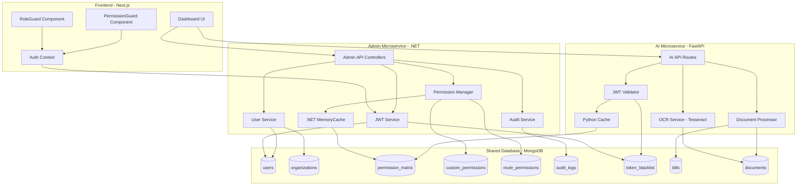
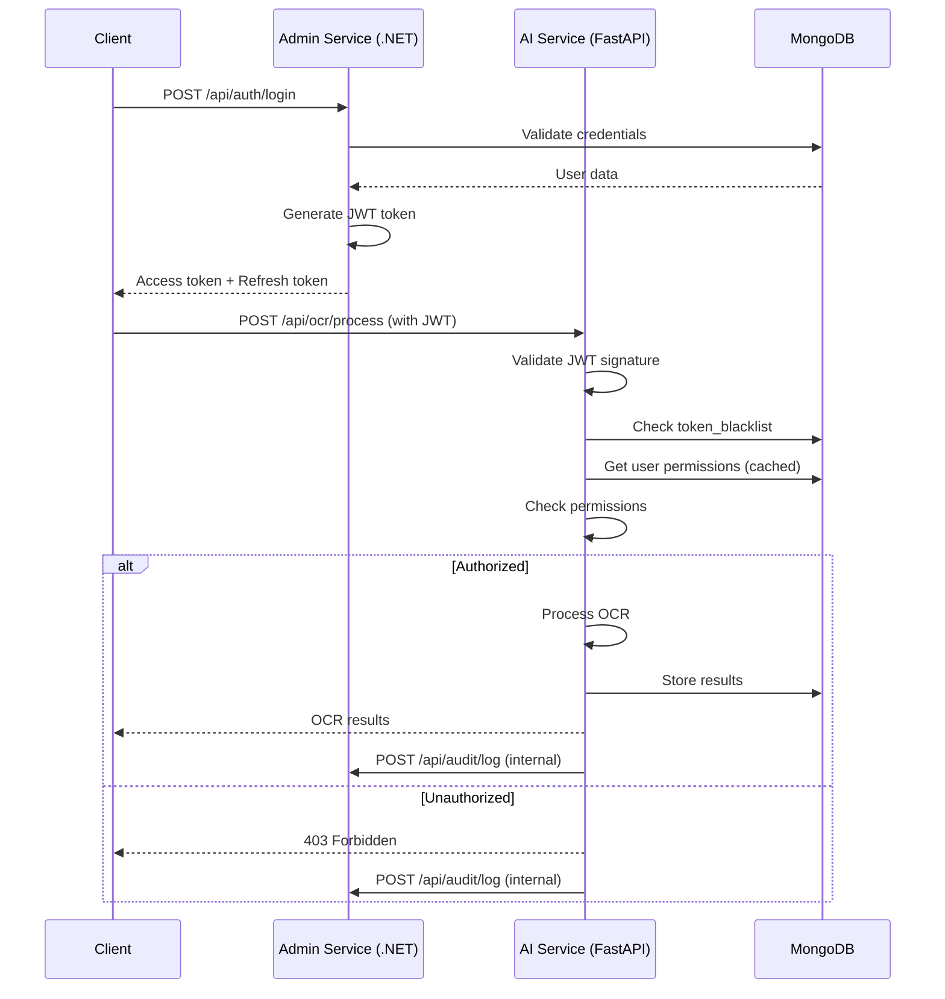

# Design Document - RBAC System

## Overview

The RBAC (Role-Based Access Control) System provides a comprehensive, dynamic security framework for KiroTax AI using a **microservices architecture**. The system is split into two services:

1. **.NET Admin Microservice** - Handles authentication, authorization, user management, permission management, and audit logging
2. **FastAPI AI Microservice** - Handles OCR (Tesseract), document processing, and AI features

Both services share a common MongoDB database and use JWT tokens for authentication and inter-service communication.

### Key Design Principles

1. **Microservices Architecture**: Separation of concerns between admin/auth and AI/processing
2. **Multi-Tenancy**: Complete data isolation between organizations using organization_id filtering
3. **Dynamic Configuration**: Permission matrix stored in database, configurable through dashboard UI
4. **Performance**: Caching layer for permission lookups with 5-minute TTL
5. **Security**: JWT tokens with short expiration, token blacklisting for immediate revocation
6. **Auditability**: Comprehensive logging of all access attempts and permission changes
7. **Extensibility**: Support for custom permissions and dynamic route protection
8. **Inter-Service Communication**: JWT-based authentication between microservices

### Technology Stack

**Admin Microservice (.NET):**
- ASP.NET Core 9.0 - Web API framework
- Blazor Server - Admin dashboard UI
- MongoDB.Driver - MongoDB client for .NET
- System.IdentityModel.Tokens.Jwt - JWT token handling
- Entity Framework Core - For SQLite admin panel data (if needed)

**AI Microservice (FastAPI):**
- FastAPI (Python) - REST API framework
- Motor - Async MongoDB driver
- PyJWT - JWT token validation
- Tesseract OCR - Document text extraction
- Pydantic - Data validation

**Frontend:**
- Next.js 14 (TypeScript) - React framework with App Router
- React Context API - Global auth state management
- Tailwind CSS - Styling
- Heroicons - UI icons

**Shared Database:**
- MongoDB - Document database for flexible schema
- Shared collections: users, organizations, permission_matrix, audit_logs, etc.

**Caching:**
- .NET MemoryCache - In-memory cache for permission matrix in Admin service
- Python dict with TTL - In-memory cache in AI service (for permission validation)

## Architecture

### System Architecture Diagram



### Microservices Communication Flow



## Components and Interfaces

### Backend Components

#### 1. JWT Service (`security/jwt.py`)

Handles token generation, validation, and refresh.

```python
class JWTService:
    """JWT token management service"""
    
    def create_access_token(
        self,
        user_id: str,
        role: str,
        organization_id: str,
        expires_delta: timedelta = None
    ) -> str:
        """Generate JWT access token with user claims"""
        
    def create_refresh_token(
        self,
        user_id: str
    ) -> str:
        """Generate long-lived refresh token"""
        
    def decode_access_token(
        self,
        token: str
    ) -> Optional[dict]:
        """Decode and validate JWT token"""
        
    def refresh_access_token(
        self,
        refresh_token: str
    ) -> Optional[str]:
        """Generate new access token from refresh token"""
        
    async def invalidate_token(
        self,
        token: str,
        reason: str
    ) -> bool:
        """Add token to blacklist"""
        
    async def is_token_blacklisted(
        self,
        token: str
    ) -> bool:
        """Check if token is blacklisted"""
```

#### 2. Permission Manager (`security/permission_manager.py`)

Manages permission matrix, custom permissions, and authorization checks.

```python
class PermissionManager:
    """Dynamic permission management"""
    
    def __init__(self):
        self.cache: Dict[str, CachedPermissions] = {}
        self.cache_ttl: int = 300  # 5 minutes
        
    async def get_user_permissions(
        self,
        user_id: str,
        organization_id: str,
        role: str
    ) -> List[str]:
        """Get all permissions for a user's role"""
        
    async def has_permission(
        self,
        user_id: str,
        organization_id: str,
        role: str,
        required_permission: str
    ) -> bool:
        """Check if user has specific permission"""
        
    async def update_role_permissions(
        self,
        organization_id: str,
        role: str,
        permissions: List[str],
        updated_by: str
    ) -> bool:
        """Update permissions for a role"""
        
    async def create_custom_permission(
        self,
        organization_id: str,
        permission_name: str,
        description: str,
        created_by: str
    ) -> str:
        """Create organization-specific permission"""
        
    async def get_route_permissions(
        self,
        route_pattern: str,
        http_method: str
    ) -> List[str]:
        """Get required permissions for an API route"""
        
    def invalidate_cache(
        self,
        organization_id: str
    ) -> None:
        """Clear cached permissions for organization"""
```

#### 3. Permission Middleware (`security/rbac_middleware.py`)

FastAPI dependency for protecting routes.

```python
def require_permission(*required_permissions: str):
    """
    Decorator to protect API endpoints with permission checks
    
    Usage:
        @router.get("/bills")
        async def get_bills(
            user: dict = Depends(require_permission("view_all_clients", "view_assigned_clients"))
        ):
            ...
    """
    async def permission_checker(
        credentials: HTTPAuthorizationCredentials = Security(HTTPBearer()),
        permission_manager: PermissionManager = Depends(get_permission_manager)
    ) -> dict:
        # Extract and validate JWT
        # Check permissions
        # Log access attempt
        # Return user dict or raise HTTPException
        pass
    
    return permission_checker


def require_organization_isolation():
    """
    Decorator to enforce organization isolation on queries
    
    Automatically filters MongoDB queries by organization_id
    """
    pass
```

#### 4. Audit Logger (`security/audit_logger.py`)

Logs all access attempts and permission changes.

```python
class AuditLogger:
    """Audit trail logging service"""
    
    async def log_access_attempt(
        self,
        user_id: str,
        organization_id: str,
        action: str,
        resource_type: str,
        resource_id: Optional[str],
        result: str,  # "success" or "denied"
        ip_address: str,
        user_agent: str
    ) -> None:
        """Log API access attempt"""
        
    async def log_permission_change(
        self,
        admin_user_id: str,
        organization_id: str,
        target_role: str,
        old_permissions: List[str],
        new_permissions: List[str]
    ) -> None:
        """Log permission matrix update"""
        
    async def log_role_change(
        self,
        admin_user_id: str,
        target_user_id: str,
        old_role: str,
        new_role: str
    ) -> None:
        """Log user role change"""
        
    async def query_audit_logs(
        self,
        organization_id: str,
        filters: dict,
        limit: int = 100
    ) -> List[dict]:
        """Query audit logs with filters"""
```

### Frontend Components

#### 1. Auth Context (`lib/auth-context.tsx`)

Global authentication state management.

```typescript
interface AuthContextType {
  user: User | null;
  isAuthenticated: boolean;
  login: (email: string, password: string) => Promise<void>;
  logout: () => void;
  refreshToken: () => Promise<void>;
}

export function AuthProvider({ children }: { children: React.ReactNode }) {
  // Manage JWT tokens in localStorage
  // Provide auth state to entire app
  // Handle token refresh
}

export function useAuth(): AuthContextType {
  // Hook to access auth context
}
```

#### 2. RoleGuard Component (`components/RoleGuard.tsx`)

Protects routes based on user role.

```typescript
interface RoleGuardProps {
  children: React.ReactNode;
  allowedRoles: Role[];
  fallback?: React.ReactNode;
}

export function RoleGuard({ children, allowedRoles, fallback }: RoleGuardProps) {
  const { user, isAuthenticated } = useAuth();
  
  // Redirect if not authenticated
  // Redirect if role not allowed
  // Render children if authorized
}
```

#### 3. PermissionGuard Component (`components/PermissionGuard.tsx`)

Conditionally renders UI based on permissions.

```typescript
interface PermissionGuardProps {
  children: React.ReactNode;
  requiredPermission: Permission;
  fallback?: React.ReactNode;
}

export function PermissionGuard({ 
  children, 
  requiredPermission, 
  fallback 
}: PermissionGuardProps) {
  const { user } = useAuth();
  
  // Check if user has permission
  // Render children or fallback
}
```

#### 4. Permission Matrix Dashboard (`app/dashboard/permissions/page.tsx`)

UI for managing role permissions.

```typescript
export default function PermissionsPage() {
  const [permissionMatrix, setPermissionMatrix] = useState<PermissionMatrix>({});
  const [customPermissions, setCustomPermissions] = useState<CustomPermission[]>([]);
  
  // Fetch permission matrix
  // Render matrix table (roles × permissions)
  // Handle permission toggle
  // Handle custom permission creation
  // Handle reset to defaults
}
```

## Data Models

### MongoDB Collections

#### 1. users Collection

```typescript
interface User {
  _id: ObjectId;
  email: string;                    // Unique
  password_hash: string;
  name: string;
  role: Role;                       // OWNER | PRACTICE_HEAD | SENIOR_CA | ARTICLE | AUDIT | INVESTOR
  organization_id: ObjectId;        // Foreign key to organizations
  assigned_clients: ObjectId[];     // Array of client IDs for SENIOR_CA
  created_at: Date;
  updated_at: Date;
  is_active: boolean;
}

// Indexes
db.users.createIndex({ email: 1 }, { unique: true });
db.users.createIndex({ organization_id: 1 });
db.users.createIndex({ role: 1, organization_id: 1 });
```

#### 2. organizations Collection

```typescript
interface Organization {
  _id: ObjectId;
  name: string;
  owner_id: ObjectId;               // Foreign key to users
  created_at: Date;
  subscription_tier: string;        // "free" | "professional" | "enterprise"
  is_active: boolean;
  settings: {
    max_users: number;
    features_enabled: string[];
  };
}

// Indexes
db.organizations.createIndex({ owner_id: 1 });
```

#### 3. permission_matrix Collection

```typescript
interface PermissionMatrix {
  _id: ObjectId;
  organization_id: ObjectId;        // Foreign key to organizations
  role: Role;
  permissions: string[];            // Array of permission strings
  updated_at: Date;
  updated_by: ObjectId;             // Foreign key to users
}

// Indexes
db.permission_matrix.createIndex({ organization_id: 1, role: 1 }, { unique: true });

// Default permissions per role
const DEFAULT_PERMISSIONS = {
  OWNER: ["*"],
  PRACTICE_HEAD: ["view_all_clients", "approve_filing", "view_investment_summary"],
  SENIOR_CA: ["view_assigned_clients"],
  ARTICLE: ["upload_documents"],
  AUDIT: ["upload_audit_doc"],
  INVESTOR: ["view_portfolio", "add_investment", "update_portfolio", "view_analytics", "upload_broker_statement"]
};
```

#### 4. custom_permissions Collection

```typescript
interface CustomPermission {
  _id: ObjectId;
  organization_id: ObjectId;
  permission_name: string;          // e.g., "review_tax_returns"
  description: string;
  created_at: Date;
  created_by: ObjectId;
  is_active: boolean;
}

// Indexes
db.custom_permissions.createIndex({ organization_id: 1, permission_name: 1 }, { unique: true });
```

#### 5. route_permissions Collection

```typescript
interface RoutePermission {
  _id: ObjectId;
  route_pattern: string;            // e.g., "/api/bills/*"
  http_method: string;              // GET | POST | PUT | DELETE | PATCH
  required_permissions: string[];   // At least one required
  description: string;
  is_active: boolean;
}

// Indexes
db.route_permissions.createIndex({ route_pattern: 1, http_method: 1 }, { unique: true });

// Example route permissions
const ROUTE_PERMISSIONS = [
  { route_pattern: "/api/bills", http_method: "GET", required_permissions: ["view_all_clients", "view_assigned_clients"] },
  { route_pattern: "/api/bills/approve", http_method: "POST", required_permissions: ["approve_filing"] },
  { route_pattern: "/api/documents/upload", http_method: "POST", required_permissions: ["upload_documents", "upload_audit_doc"] },
  { route_pattern: "/api/permissions/*", http_method: "*", required_permissions: ["*"] }
];
```

#### 6. audit_logs Collection

```typescript
interface AuditLog {
  _id: ObjectId;
  timestamp: Date;
  user_id: ObjectId;
  organization_id: ObjectId;
  action: string;                   // "access_resource" | "update_permissions" | "change_role"
  resource_type: string;            // "bill" | "client" | "document" | "permission_matrix"
  resource_id: ObjectId | null;
  result: string;                   // "success" | "denied"
  ip_address: string;
  user_agent: string;
  details: object;                  // Additional context
}

// Indexes
db.audit_logs.createIndex({ user_id: 1, timestamp: -1 });
db.audit_logs.createIndex({ organization_id: 1, timestamp: -1 });
db.audit_logs.createIndex({ timestamp: -1 });
db.audit_logs.createIndex({ resource_type: 1, resource_id: 1 });
```

#### 7. token_blacklist Collection

```typescript
interface TokenBlacklist {
  _id: ObjectId;
  token_jti: string;                // JWT ID claim
  user_id: ObjectId;
  invalidated_at: Date;
  expires_at: Date;                 // Original token expiration
  reason: string;                   // "role_change" | "manual_revocation" | "security_incident"
}

// Indexes
db.token_blacklist.createIndex({ token_jti: 1 }, { unique: true });
db.token_blacklist.createIndex({ expires_at: 1 }, { expireAfterSeconds: 0 }); // TTL index
```

### Pydantic Models (Backend)

```python
from pydantic import BaseModel, EmailStr, Field
from typing import List, Optional
from datetime import datetime
from enum import Enum

class Role(str, Enum):
    OWNER = "OWNER"
    PRACTICE_HEAD = "PRACTICE_HEAD"
    SENIOR_CA = "SENIOR_CA"
    ARTICLE = "ARTICLE"
    AUDIT = "AUDIT"
    INVESTOR = "INVESTOR"

class UserCreate(BaseModel):
    email: EmailStr
    password: str
    name: str
    role: Role
    organization_id: str

class UserResponse(BaseModel):
    id: str
    email: str
    name: str
    role: Role
    organization_id: str
    assigned_clients: List[str]
    created_at: datetime
    is_active: bool

class PermissionMatrixUpdate(BaseModel):
    role: Role
    permissions: List[str]

class CustomPermissionCreate(BaseModel):
    permission_name: str
    description: str

class RoutePermissionUpdate(BaseModel):
    route_pattern: str
    http_method: str
    required_permissions: List[str]
    description: str

class AuditLogQuery(BaseModel):
    user_id: Optional[str] = None
    resource_type: Optional[str] = None
    start_date: Optional[datetime] = None
    end_date: Optional[datetime] = None
    limit: int = 100
```

### TypeScript Types (Frontend)

```typescript
export type Role = 
  | 'OWNER'
  | 'PRACTICE_HEAD'
  | 'SENIOR_CA'
  | 'ARTICLE'
  | 'AUDIT'
  | 'INVESTOR';

export type Permission = string; // Dynamic permissions

export interface User {
  id: string;
  email: string;
  name: string;
  role: Role;
  organization_id: string;
  assigned_clients: string[];
  token?: string;
}

export interface PermissionMatrix {
  [role: string]: string[]; // role -> permissions mapping
}

export interface CustomPermission {
  id: string;
  permission_name: string;
  description: string;
  created_at: string;
}

export interface RoutePermission {
  id: string;
  route_pattern: string;
  http_method: string;
  required_permissions: string[];
  description: string;
}

export interface AuditLog {
  id: string;
  timestamp: string;
  user_id: string;
  action: string;
  resource_type: string;
  resource_id: string | null;
  result: 'success' | 'denied';
  details: object;
}
```


## Correctness Properties

*A property is a characteristic or behavior that should hold true across all valid executions of a system—essentially, a formal statement about what the system should do. Properties serve as the bridge between human-readable specifications and machine-verifiable correctness guarantees.*

### Property 1: Wildcard Permission Grants Universal Access

*For any* permission check where the user's role has wildcard permission (*), the system should return true regardless of the specific permission being checked.

**Validates: Requirements 1.2, 4.4, 8.4**

### Property 2: Organization Isolation Enforcement

*For any* data query by a user, all returned results should have an organization_id matching the user's organization_id, and attempts to access resources from other organizations should be denied.

**Validates: Requirements 2.2, 2.3**

### Property 3: User-Organization Association

*For any* authenticated user, the user record should contain exactly one organization_id field, and all resource records (bills, clients, documents) should contain an organization_id field.

**Validates: Requirements 2.1, 2.4, 2.5**

### Property 4: JWT Token Structure

*For any* successful authentication, the generated access token should decode to contain user_id, role, and organization_id claims, and should be signed with HS256 algorithm.

**Validates: Requirements 3.1, 3.7**

### Property 5: Token Expiration Times

*For any* generated access token, the expiration time should be 24 hours from creation, and for any refresh token, the expiration should be 30 days from creation.

**Validates: Requirements 3.3, 3.4**

### Property 6: Expired Token Rejection

*For any* API request with an expired access token, the system should return 401 Unauthorized and reject the request.

**Validates: Requirements 3.5**

### Property 7: Refresh Token Round Trip

*For any* valid refresh token, providing it to the refresh endpoint should successfully generate a new access token with the same user claims.

**Validates: Requirements 3.6**

### Property 8: Permission Middleware Authorization

*For any* API endpoint decorated with require_permission, the system should validate that the user has at least one of the required permissions before executing the endpoint handler, returning 403 Forbidden if unauthorized.

**Validates: Requirements 4.2, 4.3**

### Property 9: Authorization Header Validation

*For any* API request to a protected endpoint, if the Authorization header is missing or contains an invalid token, the system should return 401 Unauthorized.

**Validates: Requirements 4.6**

### Property 10: User Identity Extraction

*For any* valid JWT token in the Authorization header, the system should successfully extract user_id, role, and organization_id from the token claims.

**Validates: Requirements 4.5**

### Property 11: Assigned Client Filtering

*For any* user with view_assigned_clients permission (but not view_all_clients or wildcard), querying client data should return only clients where the assigned_to field matches the user's ID.

**Validates: Requirements 5.2**

### Property 12: Organization-Wide Client Access

*For any* user with view_all_clients permission or wildcard permission, querying client data should return all clients within the user's organization.

**Validates: Requirements 5.3, 5.4**

### Property 13: Audit Trail Creation

*For any* access attempt to a protected resource, permission change, or role assignment change, an audit log entry should be created with timestamp, user_id, organization_id, action, resource_type, resource_id, and result.

**Validates: Requirements 6.1, 6.2, 6.3**

### Property 14: Audit Log Immutability

*For any* audit log entry, attempts to modify or delete the entry should fail, ensuring append-only behavior.

**Validates: Requirements 6.5**

### Property 15: Audit Log Query Filtering

*For any* audit log query with filters (user_id, resource_type, date_range, action), the returned results should match all specified filter criteria.

**Validates: Requirements 6.6**

### Property 16: Role-Based Dashboard Redirection

*For any* user attempting to access a dashboard route that doesn't match their role, the system should redirect them to their own role-specific dashboard path.

**Validates: Requirements 7.7**

### Property 17: RoleGuard Component Hiding

*For any* user whose role is not in the RoleGuard's allowedRoles list, the component should not render its children.

**Validates: Requirements 8.2**

### Property 18: PermissionGuard Component Hiding

*For any* user who lacks the required permission specified in PermissionGuard, the component should not render its children.

**Validates: Requirements 8.6**

### Property 19: Email Uniqueness Constraint

*For any* attempt to create a user with an email that already exists in the system, the operation should fail with a unique constraint violation error.

**Validates: Requirements 9.5**

### Property 20: ObjectId Type Consistency

*For any* document in the database, the _id field should be of type ObjectId.

**Validates: Requirements 9.6**

### Property 21: Permission Matrix Initialization

*For any* newly created organization, the permission_matrix collection should be initialized with entries for all six roles (OWNER, PRACTICE_HEAD, SENIOR_CA, ARTICLE, AUDIT, INVESTOR) with their default permissions.

**Validates: Requirements 11.2**

### Property 22: Permission Matrix Query

*For any* permission check for a user, the system should query the permission_matrix collection using the user's organization_id and role to retrieve the current permissions.

**Validates: Requirements 11.6**

### Property 23: Permission Matrix Cache Management

*For any* permission matrix query, if the data is in cache and not expired (< 5 minutes old), the cached data should be used; when the permission matrix is updated, the cache for that organization should be invalidated.

**Validates: Requirements 11.7, 11.8**

### Property 24: Permission Toggle Database Update

*For any* permission checkbox toggle in the dashboard UI, the permission_matrix collection should be immediately updated with the new permission set for that role.

**Validates: Requirements 12.3**

### Property 25: Permission Matrix Metadata Tracking

*For any* role in the permission matrix, the system should track and provide which user last modified the permissions and when the modification occurred.

**Validates: Requirements 12.6**

### Property 26: Reset to Defaults Restoration

*For any* role, invoking the "Reset to Defaults" function should restore the permission set to the predefined default permissions for that role.

**Validates: Requirements 12.7**

### Property 27: Custom Permission Storage

*For any* custom permission creation request, the system should store a document in the custom_permissions collection with organization_id, permission_name, description, created_at, and created_by fields.

**Validates: Requirements 13.2**

### Property 28: Custom Permission Uniqueness

*For any* attempt to create a custom permission with a name that already exists for that organization, the operation should fail with a unique constraint violation error.

**Validates: Requirements 13.3**

### Property 29: Custom Permission Cascading Delete

*For any* custom permission deletion, the system should remove that permission from all roles in the permission_matrix that currently have it.

**Validates: Requirements 13.6**

### Property 30: Permission Name Validation

*For any* custom permission creation request, if the permission_name contains characters other than lowercase letters, numbers, and underscores, the operation should fail with a validation error.

**Validates: Requirements 13.8**

### Property 31: Route Permission Lookup

*For any* API endpoint access, the system should look up the route pattern in the route_permissions collection and validate that the user has at least one of the required permissions.

**Validates: Requirements 14.3**

### Property 32: Wildcard Route Pattern Matching

*For any* route pattern containing a wildcard (e.g., /api/bills/*), the system should match any request path that starts with the pattern prefix (e.g., /api/bills/123, /api/bills/456/approve).

**Validates: Requirements 14.4**

### Property 33: Route Permission Update Logging

*For any* route permission modification through the dashboard, an audit log entry should be created documenting the change.

**Validates: Requirements 14.8**

### Property 34: Role Change Token Invalidation

*For any* user whose role is changed, all active access tokens for that user should be added to the token_blacklist, forcing re-authentication.

**Validates: Requirements 15.1**

### Property 35: Token Blacklist Validation

*For any* access token validation, the system should check the token_blacklist collection, and if the token is blacklisted, return 401 Unauthorized with message "Token has been invalidated".

**Validates: Requirements 15.4, 15.6**

## Error Handling

### Authentication Errors

1. **Invalid Credentials**: Return 401 with message "Invalid email or password"
2. **Expired Token**: Return 401 with message "Access token has expired"
3. **Invalid Token**: Return 401 with message "Invalid authentication token"
4. **Blacklisted Token**: Return 401 with message "Token has been invalidated"
5. **Missing Authorization Header**: Return 401 with message "Authorization header required"

### Authorization Errors

1. **Insufficient Permissions**: Return 403 with message "Insufficient permissions to perform this action. Required: [permission_list]"
2. **Cross-Organization Access**: Return 403 with message "Access denied: resource belongs to different organization"
3. **Wrong Role Dashboard Access**: Redirect to user's own dashboard (not an error response)

### Validation Errors

1. **Invalid Permission Name**: Return 400 with message "Permission name must contain only lowercase letters, numbers, and underscores"
2. **Duplicate Email**: Return 409 with message "User with this email already exists"
3. **Duplicate Custom Permission**: Return 409 with message "Custom permission with this name already exists for your organization"
4. **Invalid Role**: Return 400 with message "Invalid role. Must be one of: OWNER, PRACTICE_HEAD, SENIOR_CA, ARTICLE, AUDIT, INVESTOR"

### Database Errors

1. **Connection Failure**: Return 503 with message "Database connection unavailable"
2. **Query Timeout**: Return 504 with message "Database query timeout"
3. **Document Not Found**: Return 404 with message "[Resource type] not found"

### Cache Errors

1. **Cache Miss**: Silently fall back to database query
2. **Cache Invalidation Failure**: Log error but continue operation

## Testing Strategy

### Dual Testing Approach

The RBAC system requires both unit tests and property-based tests for comprehensive coverage:

**Unit Tests** focus on:
- Specific examples of role configurations (e.g., OWNER has wildcard permission)
- Edge cases (e.g., empty permission lists, malformed tokens)
- Error conditions (e.g., expired tokens, missing headers)
- Integration points (e.g., MongoDB connection, cache initialization)
- UI component rendering (e.g., RoleGuard hides children when unauthorized)

**Property-Based Tests** focus on:
- Universal properties across all inputs (e.g., organization isolation for any user)
- Token generation and validation for random user data
- Permission checking for random role/permission combinations
- Audit logging for random access patterns
- Cache behavior for random query sequences

### Property-Based Testing Configuration

**Library**: Use `hypothesis` for Python backend tests and `fast-check` for TypeScript frontend tests.

**Test Configuration**:
- Minimum 100 iterations per property test
- Each test tagged with: `Feature: rbac-system, Property {number}: {property_text}`
- Example tag: `Feature: rbac-system, Property 2: Organization Isolation Enforcement`

**Generator Strategies**:
- Random user data (email, name, role, organization_id)
- Random permission sets (including wildcard)
- Random JWT tokens (valid, expired, malformed)
- Random organization IDs for isolation testing
- Random client assignments for filtering tests

### Test Coverage Goals

- **Backend**: 90%+ code coverage
- **Frontend**: 85%+ code coverage
- **Property Tests**: All 35 correctness properties implemented
- **Integration Tests**: End-to-end flows for authentication, authorization, and permission management

### Example Property Test (Python)

```python
from hypothesis import given, strategies as st
import pytest

@given(
    user_role=st.sampled_from(["OWNER", "PRACTICE_HEAD", "SENIOR_CA", "ARTICLE", "AUDIT", "INVESTOR"]),
    required_permission=st.text(min_size=1, max_size=50)
)
def test_property_1_wildcard_permission_grants_universal_access(user_role, required_permission):
    """
    Feature: rbac-system, Property 1: Wildcard Permission Grants Universal Access
    
    For any permission check where the user's role has wildcard permission (*),
    the system should return true regardless of the specific permission being checked.
    """
    # Arrange
    permission_manager = PermissionManager()
    org_id = "test_org_123"
    
    # Set role to have wildcard permission
    await permission_manager.update_role_permissions(
        organization_id=org_id,
        role=user_role,
        permissions=["*"],
        updated_by="admin"
    )
    
    # Act
    has_perm = await permission_manager.has_permission(
        user_id="test_user",
        organization_id=org_id,
        role=user_role,
        required_permission=required_permission
    )
    
    # Assert
    assert has_perm is True, f"Wildcard permission should grant access to {required_permission}"
```

### Example Property Test (TypeScript)

```typescript
import fc from 'fast-check';
import { hasPermission } from '@/lib/permissions';
import { Role, Permission } from '@/types';

describe('Property 1: Wildcard Permission Grants Universal Access', () => {
  it('should grant access to any permission when role has wildcard', () => {
    /**
     * Feature: rbac-system, Property 1: Wildcard Permission Grants Universal Access
     * 
     * For any permission check where the user's role has wildcard permission (*),
     * the system should return true regardless of the specific permission being checked.
     */
    fc.assert(
      fc.property(
        fc.constantFrom<Role>('OWNER', 'PRACTICE_HEAD', 'SENIOR_CA', 'ARTICLE', 'AUDIT', 'INVESTOR'),
        fc.string({ minLength: 1, maxLength: 50 }),
        (role: Role, permission: string) => {
          // Arrange: Mock role with wildcard permission
          const mockRolePermissions = { [role]: ['*'] };
          
          // Act
          const result = hasPermission(role, permission as Permission, mockRolePermissions);
          
          // Assert
          expect(result).toBe(true);
        }
      ),
      { numRuns: 100 }
    );
  });
});
```

### Integration Test Scenarios

1. **Complete Authentication Flow**
   - User registers → receives tokens → accesses protected endpoint → token expires → refreshes token

2. **Permission Matrix Management Flow**
   - Owner logs in → navigates to permissions dashboard → updates role permissions → cache invalidated → other users see new permissions

3. **Organization Isolation Flow**
   - Create two organizations → create users in each → verify users cannot access other org's data

4. **Audit Trail Flow**
   - Perform various actions → query audit logs → verify all actions logged correctly

5. **Custom Permission Flow**
   - Create custom permission → assign to role → protect endpoint with custom permission → verify access control

6. **Token Invalidation Flow**
   - User logs in → admin changes user's role → user's token blacklisted → user forced to re-authenticate

## Implementation Notes

### Performance Considerations

1. **Permission Cache**: 5-minute TTL reduces database queries by ~95% for permission checks
2. **Index Strategy**: Compound indexes on (organization_id, role) for fast permission lookups
3. **Token Blacklist Cleanup**: Daily cron job removes expired tokens to prevent table bloat
4. **Audit Log Partitioning**: Consider partitioning by month for large-scale deployments

### Security Considerations

1. **JWT Secret**: Use strong, randomly generated secret key (minimum 256 bits)
2. **Token Expiration**: Short-lived access tokens (24 hours) limit exposure window
3. **Refresh Token Rotation**: Consider implementing refresh token rotation for enhanced security
4. **Rate Limiting**: Implement rate limiting on authentication endpoints to prevent brute force
5. **Audit Log Integrity**: Consider cryptographic signing of audit logs for tamper detection

### Scalability Considerations

1. **Horizontal Scaling**: Stateless JWT design allows horizontal scaling of API servers
2. **Cache Distribution**: For multi-server deployments, use Redis instead of in-memory cache
3. **Database Sharding**: Shard by organization_id for large-scale multi-tenant deployments
4. **Read Replicas**: Use MongoDB read replicas for audit log queries

### Migration Strategy

1. **Phase 1**: Deploy new RBAC tables alongside existing system
2. **Phase 2**: Migrate existing users to new permission matrix
3. **Phase 3**: Update API endpoints to use new middleware
4. **Phase 4**: Deprecate old RBAC implementation
5. **Phase 5**: Remove old code after validation period

### Monitoring and Observability

1. **Metrics to Track**:
   - Permission check latency (p50, p95, p99)
   - Cache hit rate
   - Authentication success/failure rate
   - Token refresh rate
   - Audit log write throughput

2. **Alerts to Configure**:
   - High authentication failure rate (potential attack)
   - Cache hit rate below 80% (cache issues)
   - Permission check latency above 100ms (performance degradation)
   - Audit log write failures (data loss risk)

3. **Logging Strategy**:
   - Log all authentication attempts (success and failure)
   - Log all permission denials
   - Log all permission matrix changes
   - Log all token invalidations

